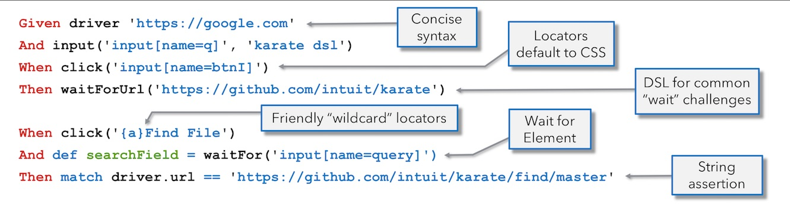

# Karate UI
## UI Test Automation Made `Simple.`

### Hello World

<a href="https://twitter.com/ptrthomas/status/1160680107784036353"></a>

# Index

<table>
<tr>
  <th>Start</th>
  <td>
      <a href="https://github.com/intuit/karate/wiki/ZIP-Release">ZIP Release</a>
    | <a href="https://github.com/intuit/karate#maven">Java</a>
    | <a href="https://github.com/intuit/karate#quickstart">Maven Quickstart</a>
    | <a href="https://github.com/intuit/karate#index">Karate - Main Index</a>
  </td>
</tr>
<tr>
  <th>Config</th>
  <td>
      <a href="#driver"><code>driver</code></a>
    | <a href="#configure-driver"><code>configure driver</code></a>
    | <a href="#configure-drivertarget"><code>configure driverTarget</code></a>
    | <a href="#karate-chrome">Docker / <code>karate-chrome</code></a>
    | <a href="#driver-types">Driver Types</a> 
    | <a href="#timeout"><code>timeout()</code></a>
    | <a href="#driversessionid"><code>driver.sessionId</code></a>
  </td>
</tr>
<tr>
  <th>Concepts</th>
  <td>
      <a href="#syntax">Syntax</a>
    | <a href="#special-keys">Special Keys</a>
    | <a href="#short-cuts">Short Cuts</a>
    | <a href="#chaining">Chaining</a> 
    | <a href="#function-composition">Function Composition</a>
    | <a href="#script">Browser JavaScript</a>
    | <a href="#debugging">Debugging</a>
    | <a href="#retry">Retries</a>
    | <a href="#wait-api">Waits</a>
    | <a href="#distributed-testing">Distributed Testing</a>
    | <a href="#proxy">Proxy</a>
    | <a href="#intercepting-http-requests">Intercepting HTTP Requests</a>
    | <a href="#file-upload">File Upload</a>
    | <a href="#code-reuse">Code Reuse</a>
    | <a href="#hybrid-tests">Hybrid Tests</a>
  </td>
</tr>
<tr>
  <th>Locators</th>
  <td>
      <a href="#locators">Locator Types</a>
    | <a href="#wildcard-locators">Wildcards</a> 
    | <a href="#friendly-locators">Friendly Locators</a> 
    | <a href="#tree-walking">Tree Walking</a>
    | <a href="#rightof"><code>rightOf()</code></a>
    | <a href="#leftOf"><code>leftOf()</code></a>
    | <a href="#above"><code>above()</code></a>
    | <a href="#below"><code>below()</code></a>
    | <a href="#near"><code>near()</code></a>
    | <a href="#locator-lookup">Locator Lookup</a>
  </td>
</tr>
<tr>
  <th>Browser</th>
  <td>
      <a href="#driverurl"><code>driver.url</code></a>
    | <a href="#driverdimensions"><code>driver.dimensions</code></a>
    | <a href="#refresh"><code>refresh()</code></a>
    | <a href="#reload"><code>reload()</code></a> 
    | <a href="#back"><code>back()</code></a>
    | <a href="#forward"><code>forward()</code></a>
    | <a href="#maximize"><code>maximize()</code></a>
    | <a href="#minimize"><code>minimize()</code></a>
    | <a href="#fullscreen"><code>fullscreen()</code></a>
    | <a href="#quit"><code>quit()</code></a>
  </td>
</tr>
<tr>
  <th>Page</th>
  <td>
      <a href="#dialog"><code>dialog()</code></a>    
    | <a href="#switchpage"><code>switchPage()</code></a>
    | <a href="#switchFrame"><code>switchFrame()</code></a> 
    | <a href="#close"><code>close()</code></a>    
    | <a href="#drivertitle"><code>driver.title</code></a>
    | <a href="#screenshot"><code>screenshot()</code></a>    
  </td>
</tr>
<tr>
  <th>Actions</th>
  <td>
      <a href="#click"><code>click()</code></a>
    | <a href="#input"><code>input()</code></a>
    | <a href="#submit"><code>submit()</code></a>
    | <a href="#focus"><code>focus()</code></a>
    | <a href="#clear"><code>clear()</code></a>
    | <a href="#valueset"><code>value(set)</code></a>   
    | <a href="#select"><code>select()</code></a>
    | <a href="#scroll"><code>scroll()</code></a>
    | <a href="#mouse"><code>mouse()</code></a>
    | <a href="#highlight"><code>highlight()</code></a>
    | <a href="#highlightall"><code>highlightAll()</code></a>
  </td>
</tr>
<tr>
  <th>State</th>
  <td>
      <a href="#html"><code>html()</code></a>
    | <a href="#text"><code>text()</code></a>
    | <a href="#value"><code>value()</code></a>
    | <a href="#attribute"><code>attribute()</code></a>
    | <a href="#enabled"><code>enabled()</code></a>
    | <a href="#exists"><code>exists()</code></a>
    | <a href="#optional"><code>optional()</code></a>    
    | <a href="#locate"><code>locate()</code></a>    
    | <a href="#locateall"><code>locateAll()</code></a>
    | <a href="#position"><code>position()</code></a>
  </td>
</tr>
<tr>
  <th>Wait / JS</th>
  <td>
      <a href="#retry"><code>retry()</code></a>
    | <a href="#waitfor"><code>waitFor()</code></a>    
    | <a href="#waitforany"><code>waitForAny()</code></a>
    | <a href="#waitforurl"><code>waitForUrl()</code></a>
    | <a href="#waitfortext"><code>waitForText()</code></a>
    | <a href="#waitforenabled"><code>waitForEnabled()</code></a>
    | <a href="#waitforresultcount"><code>waitForResultCount()</code></a>  
    | <a href="#waituntil"><code>waitUntil()</code></a>    
    | <a href="#delay"><code>delay()</code></a>
    | <a href="#script"><code>script()</code></a>
    | <a href="#scriptall"><code>scriptAll()</code></a>
    | <a href="#karate-vs-the-browser">Karate vs the Browser</a>
  </td>
</tr>
<tr>
  <th>Cookies</th>
  <td>
      <a href="#cookie"><code>cookie()</code></a>
      <a href="#cookieset"><code>cookie(set)</code></a>
    | <a href="#drivercookies"><code>driver.cookies</code></a>
    | <a href="#deletecookie"><code>deleteCookie()</code></a>
    | <a href="#clearcookies"><code>clearCookies()</code></a>
  </td>
</tr>
<tr>
  <th>Chrome</th>
  <td>
      <a href="#chrome-java-api">Java API</a>
    | <a href="#driverpdf"><code>driver.pdf()</code></a>
    | <a href="#driverscreenshotfull"><code>driver.screenshotFull()</code></a>
    | <a href="#driverintercept"><code>driver.intercept()</code></a>
    | <a href="#driverinputfile"><code>driver.inputFile()</code></a>
    | <a href="#driveremulatedevice"><code>driver.emulateDevice()</code></a> 
  </td> 
</tr>
<tr>
  <th>Appium</th>
  <td>
      <a href="#screen-recording">Screen Recording</a>
    | <a href="#screen-recording"><code>driver.startRecordingScreen()</code></a>
    | <a href="#screen-recording"><code>driver.saveRecordingScreen()</code></a>
    | <a href="#driverhidekeyboard"><code>driver.hideKeyboard()</code></a>
  </td> 
</tr>
</table>

## Capabilities

* Simple, clean syntax that is well suited for people new to programming or test-automation
* All-in-one framework that includes [parallel-execution](https://github.com/intuit/karate#parallel-execution), [HTML reports](https://github.com/intuit/karate#junit-html-report), [environment-switching](https://github.com/intuit/karate#switching-the-environment), and [CI integration](https://github.com/intuit/karate#test-reports)
* Cross-platform - with even the option to run as a programming-language *neutral* [stand-alone executable](https://github.com/intuit/karate/wiki/ZIP-Release)
* No need to learn complicated programming concepts such as "callbacks" "`await`" and "promises"
* Option to use [wildcard](#wildcard-locators) and ["friendly" locators](#friendly-locators) without needing to inspect the HTML-page source, CSS, or internal XPath structure
* Chrome-native automation using the [Chrome DevTools Protocol](https://chromedevtools.github.io/devtools-protocol/) (equivalent to [Puppeteer](https://pptr.dev))
* [W3C WebDriver](https://w3c.github.io/webdriver/) support built-in, which can also use [remote / grid providers](https://twitter.com/ptrthomas/status/1222790566598991873)
* [Cross-Browser support](https://twitter.com/ptrthomas/status/1048260573513666560) including [Microsoft Edge on Windows](https://twitter.com/ptrthomas/status/1046459965668388866) and [Safari on Mac](https://twitter.com/ptrthomas/status/1047152170468954112)
* [Parallel execution on a single node](https://twitter.com/ptrthomas/status/1159295560794308609), cloud-CI environment or [Docker](#configure-drivertarget) - without needing a "master node" or "grid"
* You can even run tests in parallel across [different machines](#distributed-testing) - and Karate will aggregate the results
* Embed [video-recordings of tests](#karate-chrome) into the HTML report from a Docker container
* Windows [Desktop application automation](https://twitter.com/KarateDSL/status/1052432964804640768) using the Microsoft [WinAppDriver](https://github.com/Microsoft/WinAppDriver)
* [Android and iOS mobile support](https://github.com/intuit/karate/issues/743) via [Appium](http://appium.io)
* Seamlessly mix API and UI tests within the same script, for example [sign-in using an API](https://github.com/intuit/karate#http-basic-authentication-example) and speed-up your tests
* Use the power of Karate's [`match`](https://github.com/intuit/karate#prepare-mutate-assert) assertions and [core capabilities](https://github.com/intuit/karate#features) for UI assertions
* Simple [retry](#retry) and [wait](#wait-api) strategy, no need to graduate from any test-automation university to understand the difference between "implicit waits", "explicit waits" and "fluent waits" :)
* Simpler, [elegant, and *DRY* alternative](#locator-lookup) to the so-called "Page Object Model" pattern
* Carefully designed [fluent-API](#chaining) to handle common combinations such as a [`submit()` + `click()`](#submit) action
* Elegant syntax for typical web-automation challenges such as waiting for a [page-load](#waitforurl-instead-of-submit) or [element to appear](#waitfor)
* Execute JavaScript in the browser with [one-liners](#script) - for example to [get data out of an HTML table](#scriptall)
* [Compose re-usable functions](#function-composition) based on your specific environment or application needs
* Comprehensive support for user-input types including [key-combinations](#special-keys) and [`mouse()`](#mouse) actions
* Step-debug and even *"go back in time"* to edit and re-play steps - using the unique, innovative [Karate Extension for Visual Studio Code](https://twitter.com/KarateDSL/status/1167533484560142336)
* Traceability: detailed [wire-protocol logs](https://twitter.com/ptrthomas/status/1155958170335891467) can be enabled *in-line* with test-steps in the HTML report
* Convert HTML to PDF and capture the *entire* (scrollable) web-page as an image using the [Chrome Java API](#chrome-java-api)

## Comparison
To understand how Karate compares to other UI automation frameworks, this article can be a good starting point: [The world needs an alternative to Selenium - *so we built one*](https://hackernoon.com/the-world-needs-an-alternative-to-selenium-so-we-built-one-zrk3j3nyr).

# Examples
## Web Browser
* [Example 1](../karate-demo/src/test/java/driver/demo/demo-01.feature) - simple example that navigates to GitHub and Google Search
* [Example 2](../karate-demo/src/test/java/driver/demo/demo-02.feature) - simple but *very* relevant and meaty example ([see video](https://twitter.com/ptrthomas/status/1160680240781262851)) that shows how to
  * wait for [page-navigation](#waitforurl-instead-of-submit)
  * use a friendly [wildcard locator](#wildcard-locators)
  * wait for an element to [be ready](#waitfor)
  * [compose functions](#function-composition) for elegant *custom* "wait" logic
  * assert on tabular [results in the HTML](#scriptall)
* [Example 3](../karate-demo/src/test/java/driver/core/test-01.feature) - which is a single script that exercises *all* capabilities of Karate Driver, so is a handy reference

## Windows
* [Example](../karate-demo/src/test/java/driver/windows/calc.feature) - but also see the [`karate-robot`](https://github.com/intuit/karate/tree/master/karate-robot) for an alternative approach.

# Driver Configuration

## `configure driver`

This below declares that the native (direct) Chrome integration should be used, on both Mac OS and Windows - from the default installed location.

```cucumber
* configure driver = { type: 'chrome' }
```

If you want to customize the start-up, you can use a batch-file:

```cucumber
* configure driver = { type: 'chrome', executable: 'chrome' }
```

Here a batch-file called `chrome` can be placed in the system [`PATH`](https://www.java.com/en/download/help/path.xml) (and made executable) with the following contents:

```bash
"/Applications/Google Chrome.app/Contents/MacOS/Google Chrome" $*
```

For Windows it would be `chrome.bat` in the system [`PATH`](https://www.java.com/en/download/help/path.xml) as follows:

```bat
"C:\Program Files (x86)\Google\Chrome\Application\chrome" %*
```

Another example for WebDriver, again assuming that `chromedriver` is in the [`PATH`](https://www.java.com/en/download/help/path.xml):

```cucumber
{ type: 'chromedriver', port: 9515, executable: 'chromedriver' }
```

key | description
--- | -----------
`type` | see [driver types](#driver-types)
`executable` | if present, Karate will attempt to invoke this, if not in the system [`PATH`](https://www.java.com/en/download/help/path.xml), you can use a full-path instead of just the name of the executable. batch files should also work
`start` | default `true`, Karate will attempt to start the `executable` - and if the `executable` is not defined, Karate will even try to assume the default for the OS in use
`port` | optional, and Karate would choose the "traditional" port for the given `type`
`host` | optional, will default to `localhost` and you normally never need to change this
`pollAttempts` | optional, will default to `20`, you normally never need to change this (and changing `pollInterval` is preferred), and this is the number of attempts Karate will make to wait for the `port` to be ready and accepting connections before proceeding
`pollInterval` | optional, will default to `250` (milliseconds) and you normally never need to change this (see `pollAttempts`) unless the driver `executable` takes a *very* long time to start
`headless` | [headless mode](https://developers.google.com/web/updates/2017/04/headless-chrome) only applies to `{ type: 'chrome' }` for now, also see [`DockerTarget`](#dockertarget) and [`webDriverSession`](#webdriversession)
`showDriverLog` | default `false`, will include webdriver HTTP traffic in Karate report, useful for troubleshooting or bug reports
`showProcessLog` | default `false`, will include even executable (webdriver or browser) logs in the Karate report
`addOptions` | default `null`, has to be a list / JSON array that will be appended as additional CLI arguments to the `executable`, e.g. `['--no-sandbox', '--windows-size=1920,1080']`
`beforeStart` | default `null`, an OS command that will be executed before commencing a `Scenario` (and before the `executable` is invoked if applicable) typically used to start video-recording
`afterStop` | default `null`, an OS command that will be executed after a `Scenario` completes, typically used to stop video-recording and save the video file to an output folder
`videoFile` | default `null`, the path to the video file that will be added to the end of the test report, if it does not exist, it will be ignored
`httpConfig` | optional, and typically only used for remote WebDriver usage where the HTTP client [configuration](https://github.com/intuit/karate#configure) needs to be tweaked, e.g. `{ readTimeout: 120000 }` (also see `timeout` below)
`timeout` | default `30000`,  amount of time (in milliseconds) that type `chrome` will wait for an operation that takes time (typically navigating to a new page) - and as a convenience for WebDriver, this will be equivalent to setting the `readTimeout` for the `httpConfig` (see above) - also see [`timeout()`](#timeout)
`webDriverUrl` | see [`webDriverUrl`](#webdriverurl)
`webDriverSession` | see [`webDriverSession`](#webdriversession)
`webDriverPath` | optional, and rarely used only in case you need to append a path such as `/wd/hub` - typically needed for Appium (or a Selenium Grid) on `localhost`, where `host`, `port` / `executable` etc. are involved.
`highlight` | default `false`, useful for demos or for running a test in "slow motion" where before each navigation action, the HTML element for the current [locator](#locators) is highlighted for a duration of `highlightDuration`
`highlightDuration` | default 3000 (milliseconds), duration to apply the `highlight`
`attach` | optional, only for `type: 'chrome'` and `start: false` when you want to attach to an existing page in a Chrome DevTools session, uses a "contains" match against the URL
`userDataDir` | optional, by default Karate will auto-create a [user dir](https://chromium.googlesource.com/chromium/src.git/+/master/docs/user_data_dir.md) for Chrome and other browsers, but if you want to provide the path to an existing folder (which can reduce disk space usage in some situations), note that for Chrome, this will pass the command line option `--user-data-dir`. if `null`, Chrome will use the system defaults (the `--user-data-dir` command-line option will *not* be passed)

For more advanced options such as for Docker, CI, headless, cloud-environments or custom needs, see [`configure driverTarget`](#configure-drivertarget).

## webDriverUrl
Karate implements the [W3C WebDriver spec](https://w3c.github.io/webdriver), which means that you can point Karate to a remote "grid" such as [Zalenium](https://opensource.zalando.com/zalenium/) or a SaaS provider such as [the AWS Device Farm](https://docs.aws.amazon.com/devicefarm/latest/testgrid/what-is-testgrid.html). The `webDriverUrl` driver configuration key is optional, but if specified, will be used as the W3C WebDriver remote server. Note that you typically would set `start: false` as well, or use a [Custom `Target`](#custom-target).

For example, once you run the [couple of Docker commands](https://opensource.zalando.com/zalenium/#try-it) to get Zalenium running, you can do this:

```cucumber
* configure driver = { type: 'chromedriver', start: false, webDriverUrl: 'http://localhost:4444/wd/hub' }
```

Note that you can add `showDriverLog: true` to the above for troubleshooting if needed. You should be able to [run tests in parallel](https://github.com/intuit/karate#parallel-execution) with ease !

## `webDriverSession`
When targeting a W3C WebDriver implementation, either as a local executable or [Remote WebDriver](https://selenium.dev/documentation/en/remote_webdriver/remote_webdriver_client/), you can specify the JSON that will be passed as the payload to the [Create Session](https://w3c.github.io/webdriver/#new-session) API. The most important part of this payload is the [`capabilities`](https://w3c.github.io/webdriver/#capabilities). It will default to `{ browserName: '<name>' }` for convenience where `<name>` will be `chrome`, `firefox` etc.

So most of the time this would be sufficient:

```cucumber
* configure driver = { type: 'chromedriver' }
```

Since it will result in the following request to the WebDriver `/session`:

```js
{"capabilities":{"alwaysMatch":{"browserName":"chrome"}}}
```

But in some cases, especially when you need to talk to remote driver instances, you need to pass specific "shapes" of JSON expected by the particular implementation - or you may need to pass custom data or "extension" properties. Use the `webDriverSession` property in those cases. For example:

```cucumber
* def session = { capabilities: { browserName: 'chrome' }, desiredCapabilities: { browserName: 'chrome' } }
* configure driver = { type: 'chromedriver', webDriverSession: '#(session)', start: false, webDriverUrl: 'http://localhost:9515/wd/hub' }
```

Another example is that for the new Microsoft Edge browser (based on Chromium), the Karate default `alwaysMatch` is not supported, so this is what works:

```cucumber
* configure driver = { type: 'msedgedriver', webDriverSession: { capabilities: { browserName: 'edge' } } }
```

Here are some of the things that you can customize, but note that these depend on the driver implementation.

* [`proxy`](#proxy)
* [`acceptInsecureCerts`](https://w3c.github.io/webdriver/#dfn-insecure-tls-certificates)
* [`moz:firefoxOptions`](https://developer.mozilla.org/en-US/docs/Web/WebDriver/Capabilities/firefoxOptions#firefoxOptions) - e.g. for headless FireFox

Note that some capabilities such as "headless" may be possible via the command-line to the local executable, so using [`addOptions`](#configure-driver) may work instead.

Also see [`driver.sessionId`](#driversessionid).

## `configure driverTarget`
The [`configure driver`](#configure-driver) options are fine for testing on "`localhost`" and when not in `headless` mode. But when the time comes for running your web-UI automation tests on a continuous integration server, things get interesting. To support all the various options such as Docker, headless Chrome, cloud-providers etc., Karate introduces the concept of a pluggable [`Target`](src/main/java/com/intuit/karate/driver/Target.java) where you just have to implement two methods:

```java
public interface Target {        
    
    Map<String, Object> start(com.intuit.karate.Logger logger);
    
    Map<String, Object> stop(com.intuit.karate.Logger logger);
    
}
```

* `start()`: The `Map` returned will be used as the generated [driver configuration](#driver-configuration). And the `start()` method will be invoked as soon as any `Scenario` requests for a web-browser instance (for the first time) via the [`driver`](#driver) keyword.

* `stop()`: Karate will call this method at the end of every top-level `Scenario` (that has not been `call`-ed by another `Scenario`).

If you use the provided `Logger` instance in your `Target` code, any logging you perform will nicely appear in-line with test-steps in the HTML report, which is great for troubleshooting or debugging tests.

Combined with Docker, headless Chrome and Karate's [parallel-execution capabilities](https://github.com/intuit/karate#parallel-execution) - this simple `start()` and `stop()` lifecycle can effectively run web UI automation tests in parallel on a single node.

### `DockerTarget`
Karate has a built-in implementation for Docker ([`DockerTarget`](src/main/java/com/intuit/karate/driver/DockerTarget.java)) that supports 2 existing Docker images out of the box:

* [`justinribeiro/chrome-headless`](https://hub.docker.com/r/justinribeiro/chrome-headless/) - for Chrome "native" in [headless mode](https://developers.google.com/web/updates/2017/04/headless-chrome)
* [`ptrthomas/karate-chrome`](#karate-chrome) - for Chrome "native" but with an option to connect to the container and view via VNC, and with video-recording

To use either of the above, you do this in a Karate test:

```cucumber
* configure driverTarget = { docker: 'justinribeiro/chrome-headless', showDriverLog: true }
```

Or for more flexibility, you could do this in [`karate-config.js`](https://github.com/intuit/karate#configuration) and perform conditional logic based on [`karate.env`](https://github.com/intuit/karate#switching-the-environment). One very convenient aspect of `configure driverTarget` is that *if* in-scope, it will over-ride any `configure driver` directives that exist. This means that you can have the below snippet activate *only* for your CI build, and you can leave your feature files set to point to what you would use in "dev-local" mode.

```javascript
function fn() {
    var config = {
        baseUrl: 'https://qa.mycompany.com'
    };
    if (karate.env == 'ci') {
        karate.configure('driverTarget', { docker: 'ptrthomas/karate-chrome' });
    }
    return config;
}
```

To use the [recommended `--security-opt seccomp=chrome.json` Docker option](https://hub.docker.com/r/justinribeiro/chrome-headless/), add a `secComp` property to the `driverTarget` configuration. And if you need to view the container display via VNC, set the `vncPort` to map the port exposed by Docker.

```javascript
karate.configure('driverTarget', { docker: 'ptrthomas/karate-chrome', secComp: 'src/test/java/chrome.json', vncPort: 5900 });
```

### Custom `Target`
If you have a custom implementation of a `Target`, you can easily [construct any custom Java class](https://github.com/intuit/karate#calling-java) and pass it to `configure driverTarget`. Here below is the equivalent of the above, done the "hard way":

```javascript
var DockerTarget = Java.type('com.intuit.karate.driver.DockerTarget');
var options = { showDriverLog: true };
var target = new DockerTarget(options);
target.command = function(port){ return 'docker run -d -p ' 
    + port + ':9222 --security-opt seccomp=./chrome.json justinribeiro/chrome-headless' };
karate.configure('driverTarget', target);
```

The built-in [`DockerTarget`](src/main/java/com/intuit/karate/driver/DockerTarget.java) is a good example of how to:
* perform any pre-test set-up actions
* provision a free port and use it to shape the `start()` command dynamically
* execute the command to start the target process
* perform an HTTP health check to wait until we are ready to receive connections
* and when `stop()` is called, indicate if a video recording is present (after retrieving it from the stopped container)

Controlling this flow from Java can take a lot of complexity out your build pipeline and keep things cross-platform. And you don't need to line-up an assortment of shell-scripts to do all these things. You can potentially include the steps of deploying (and un-deploying) the application-under-test using this approach - but probably the top-level [JUnit test-suite](https://github.com/intuit/karate#parallel-execution) would be the right place for those.

Another (simple) example of a custom `Target` you can use as a reference is this one: [`karate-devicefarm-demo`](https://github.com/ptrthomas/karate-devicefarm-demo) - which demonstrates how Karate can be used to drive tests on [AWS DeviceFarm](https://docs.aws.amazon.com/devicefarm/latest/testgrid/what-is-testgrid.html). The same approach should apply to any Selenium "grid" provider such as [Zalenium](https://opensource.zalando.com/zalenium/).

### `karate-chrome`
The [`karate-chrome`](https://hub.docker.com/r/ptrthomas/karate-chrome) Docker is an image created from scratch, using a Java / Maven image as a base and with the following features:

* Chrome in "full" mode (non-headless)
* [Chrome DevTools protocol](https://chromedevtools.github.io/devtools-protocol/) exposed on port 9222
* VNC server exposed on port 5900 so that you can watch the browser in real-time
* a video of the entire test is saved to `/tmp/karate.mp4`
* after the test, when `stop()` is called, the [`DockerTarget`](src/main/java/com/intuit/karate/driver/DockerTarget.java) will embed the video into the HTML report (expand the last step in the `Scenario` to view)

To try this or especially when you need to investigate why a test is not behaving properly when running within Docker, these are the steps:

* start the container:
  * `docker run --name karate --rm -p 9222:9222 -p 5900:5900 -e KARATE_SOCAT_START=true --cap-add=SYS_ADMIN ptrthomas/karate-chrome`
  * it is recommended to use [`--security-opt seccomp=chrome.json`](https://hub.docker.com/r/justinribeiro/chrome-headless/) instead of `--cap-add=SYS_ADMIN`
* point your VNC client to `localhost:5900` (password: `karate`)
  * for example on a Mac you can use this command: `open vnc://localhost:5900`
* run a test using the following [`driver` configuration](#configure-driver), and this is one of the few times you would ever need to set the [`start` flag](#configure-driver) to `false`
  * `* configure driver = { type: 'chrome', start: false, showDriverLog: true }`
* you can even use the [Karate VS Code extension](https://github.com/intuit/karate/wiki/IDE-Support#vs-code-karate-plugin) to debug and step-through a test
* if you omit the `--rm` part in the start command, after stopping the container, you can dump the logs and video recording using this command (here `.` stands for the current working folder, change it if needed):
  * `docker cp karate:/tmp .`
  * this would include the `stderr` and `stdout` logs from Chrome, which can be helpful for troubleshooting

For more information on the Docker containers for Karate and how to use them, refer to the wiki: [Docker](https://github.com/intuit/karate/wiki/Docker).

## Driver Types
The recommendation is that you prefer `chrome` for development, and once you have the tests running smoothly - you can switch to a different WebDriver implementation.

type | default port | default executable | description
---- | ------------ | ------------------ | -----------
[`chrome`](https://chromedevtools.github.io/devtools-protocol/) | 9222 | mac: `/Applications/Google Chrome.app/Contents/MacOS/Google Chrome`<br/>win: `C:/Program Files (x86)/Google/Chrome/Application/chrome.exe` | "native" Chrome automation via the [DevTools protocol](https://chromedevtools.github.io/devtools-protocol/)
[`chromedriver`](https://sites.google.com/a/chromium.org/chromedriver/home) | 9515 | `chromedriver` | W3C Chrome Driver
[`geckodriver`](https://github.com/mozilla/geckodriver) | 4444 | `geckodriver` | W3C Gecko Driver (Firefox)
[`safaridriver`](https://webkit.org/blog/6900/webdriver-support-in-safari-10/) | 5555 | `safaridriver` | W3C Safari Driver
[`msedgedriver`](https://developer.microsoft.com/en-us/microsoft-edge/tools/webdriver/) | 9515 | `msedgedriver` | W3C Microsoft Edge WebDriver (the new one based on Chromium), also see [`webDriverSession`](#webdriversession)
[`mswebdriver`](https://developer.microsoft.com/en-us/microsoft-edge/tools/webdriver/) | 17556 | `MicrosoftWebDriver` | Microsoft Edge "Legacy" WebDriver
[`iedriver`](https://github.com/SeleniumHQ/selenium/wiki/InternetExplorerDriver) | 5555 | `IEDriverServer` | IE (11 only) Driver
[`msedge`](https://docs.microsoft.com/en-us/microsoft-edge/devtools-protocol/) | 9222 | `MicrosoftEdge` | *very* experimental - using the DevTools protocol
[`winappdriver`](https://github.com/Microsoft/WinAppDriver) | 4727 | `C:/Program Files (x86)/Windows Application Driver/WinAppDriver` | Windows Desktop automation, similar to Appium
[`android`](https://github.com/appium/appium/) | 4723 | `appium` | android automation via [Appium](https://github.com/appium/appium/)
[`ios`](https://github.com/appium/appium/) | 4723 |`appium` | iOS automation via [Appium](https://github.com/appium/appium/)

# Distributed Testing
Karate can split a test-suite across multiple machines or Docker containers for execution and aggregate the results. Please refer to the wiki: [Distributed Testing](https://github.com/intuit/karate/wiki/Distributed-Testing).

# Locators
The standard locator syntax is supported. For example for web-automation, a `/` prefix means XPath and else it would be evaluated as a "CSS selector".

```cucumber
And input('input[name=someName]', 'test input')
When submit().click("//input[@name='commit']")
```

platform | prefix | means | example
----- | ------ | ----- | -------
web | (none) | css selector | `input[name=someName]`
web <br/> android <br/> ios | `/` | xpath | `//input[@name='commit']`
web | `{}` | [exact text content](#wildcard-locators) | `{a}Click Me`
web | `{^}` | [partial text content](#wildcard-locators) | `{^a}Click Me`
win <br/> android <br/> ios| (none) | name | `Submit`
win <br/> android <br/> ios | `@` | accessibility id | `@CalculatorResults`
win <br/> android <br/> ios | `#` | id | `#MyButton`
ios| `:` | -ios predicate string | `:name == 'OK' type == XCUIElementTypeButton`
ios| `^` | -ios class chain | `^**/XCUIElementTypeTable[name == 'dataTable']`
android| `-` | -android uiautomator | `-input[name=someName]`

## Wildcard Locators
The "`{}`" and "`{^}`" locator-prefixes are designed to make finding an HTML element by *text content* super-easy. You will typically also match against a specific HTML tag (which is preferred, and faster at run-time). But even if you use "`{*}`" (or "`{}`" which is the equivalent short-cut) to match *any* tag, you are selecting based on what the user *sees on the page*.

When you use CSS and XPath, you need to understand the internal CSS class-names and XPath structure of the page. But when you use the visible text-content, for example the text within a `<button>` or hyperlink (`<a>`), performing a "selection" can be far easier. And this kind of locator is likely to be more stable and resistant to cosmetic changes to the underlying HTML.

You have the option to adjust the "scope" of the match, and here are examples:

Locator | Description
------- | -----------
`click('{a}Click Me')` | the first `<a>` where the text-content is *exactly*: `Click Me`
`click('{}Click Me')` | the first element (*any* tag name) where the text-content is *exactly*: `Click Me`
`click('{^}Click')` | the first element (*any* tag name) where the text-content *contains*: `Click`
`click('{^span}Click')` | the first `<span>` where the text-content *contains*: `Click`
`click('{div:2}Click Me')` | the second `<div>` where the text-content is *exactly*: `Click Me`
`click('{span/a}Click Me')` | the first `<a>` where a `<span>` is the immediate parent, and where the text-content is *exactly*: `Click Me`
`click('{^*:4}Me')` | the fourth HTML element (of *any* tag name) where the text-content *contains*: `Me`

Note that "`{:4}`" can be used as a short-cut instead of "`{*:4}`".

You can experiment by using XPath snippets like the "`span/a`" seen above for even more "narrowing down", but try to expand the "scope modifier" (the part within curly braces) only when you need to do "de-duping" in case the same *user-facing* text appears multiple times on a page.

## Friendly Locators
The ["wildcard" locators](#wildcard-locators) are great when the human-facing visible text is *within* the HTML element that you want to interact with. But this approach doesn't work when you have to deal with data-entry and `<input>` fields. This is where the "friendly locators" come in. You can ask for an element by its *relative position* to another element which is visible - such as a `<span>`, `<div>` or `<label>` and for which the [locator](#locators) is easy to obtain.

> Also see [Tree Walking](#tree-walking).

Method | Finds Element
------ | -----------
[`rightOf()`](#rightof) | to *right* of given locator
[`leftOf()`](#leftof) | to *left* of given locator
[`above()`](#above) | *above* given locator
[`below()`](#below) | *below* given locator
[`near()`](#near) | *near* given locator in any direction

The above methods return a [chainable](#chaining) [`Finder`](src/main/java/com/intuit/karate/driver/Finder.java) instance. For example if you have HTML like this:

```html
<input type="checkbox"><span>Check Three</span>
```

To click on the checkbox, you just need to do this:

```cucumber
* leftOf('{}Check Three').click()
```

By default, the HTML tag that will be searched for will be `input`. While rarely needed, you can over-ride this by calling the `find(tagName)` method like this:

```cucumber
* rightOf('{}Some Text').find('span').click()
```

One more variation supported is that instead of an HTML tag name, you can look for the `textContent`:

```cucumber
* rightOf('{}Some Text').find('{}Click Me').click()
```

One thing to watch out for is that the "origin" of the search will be the mid-point of the whole HTML element, not just the text. So especially when doing `above()` or `below()`, ensure that the "search path" is aligned the way you expect. If you get stuck trying to align the search path, especially if the "origin" is a small chunk of text that is aligned right or left - try [`near()`](#near).

In addition to `<input>` fields, `<select>` boxes are directly supported like this, so internally a `find('select')` is "[chained](#chaining)" automatically:

```cucumber
* below('{}State').select(0)
```

### `rightOf()`
```cucumber
* rightOf('{}Input On Right').input('input right')
```

### `leftOf()`
```cucumber
* leftOf('{}Input On Left').clear().input('input left')
```
### `above()`
```cucumber
* above('{}Input On Right').click()
```

### `below()`
```cucumber
* below('{}Input On Right').input('input below')
```

### `near()`
One reason why you would need `near()` is because an `<input>` field may either be on the right or below the label depending on whether the "container" element had enough width to fit both on the same horizontal line. Of course this can be useful if the element you are seeking is diagonally offset from the [locator](#locators) you have.

```cucumber
 * near('{}Go to Page One').click()
```

# Keywords
Only one keyword sets up UI automation in Karate, typically by specifying the URL to open in a browser. And then you would use the built-in [`driver`](#syntax) JS object for all other operations, combined with Karate's [`match`](https://github.com/intuit/karate#prepare-mutate-assert) syntax for assertions where needed.

## `driver`
Navigates to a new page / address. If this is the first instance in a test, this step also initializes the [`driver`](#syntax) instance for all subsequent steps - using what is [configured](#configure-driver).

```cucumber
Given driver 'https://github.com/login'
```

And yes, you can use [variable expressions](https://github.com/intuit/karate#karate-expressions) from [`karate-config.js`](https://github.com/intuit/karate#configuration). For example:

```cucumber
* driver webUrlBase + '/page-01'
```

> As seen above, you don't have to force all your steps to use the `Given`, `When`, `Then` BDD convention, and you can [just use "`*`" instead](https://github.com/intuit/karate#given-when-then).

### `driver` JSON
A variation where the argument is JSON instead of a URL / address-string, used typically if you are testing a desktop (or mobile) application. This example is for Windows, and you can provide the `app`, `appArguments` and other parameters expected by the [WinAppDriver](https://github.com/Microsoft/WinAppDriver) via the [`webDriverSession`](#webdriversession). For example:

```cucumber
* def session = { desiredCapabilities: { app: 'Microsoft.WindowsCalculator_8wekyb3d8bbwe!App' } }
Given driver { webDriverSession: '#(session)' }
```

So this is just for convenience and readability, using [`configure driver`](#configure-driver) can do the same thing like this:

```cucumber
* def session = { desiredCapabilities: { app: 'Microsoft.WindowsCalculator_8wekyb3d8bbwe!App' } }
* configure driver = { webDriverSession: '#(session)' }
Given driver {}
```

This design is so that you can use (and data-drive) all the capabilities supported by the target driver - which can vary a lot depending on whether it is local, remote, for desktop or mobile etc.

# Syntax
The built-in `driver` JS object is where you script UI automation. It will be initialized only after the [`driver`](#driver) keyword has been used to navigate to a web-page (or application).

You can refer to the [Java interface definition](src/main/java/com/intuit/karate/driver/Driver.java) of the `driver` object to better understand what the various operations are. Note that `Map<String, Object>` [translates to JSON](https://github.com/intuit/karate#type-conversion), and JavaBean getters and setters translate to JS properties - e.g. `driver.getTitle()` becomes `driver.title`.

## Methods
As a convenience, *all* the methods on the `driver` have been injected into the context as special (JavaScript) variables so you can omit the "`driver.`" part and save a lot of typing. For example instead of:

```cucumber
And driver.input('#eg02InputId', Key.SHIFT)
Then match driver.text('#eg02DivId') == '16'
```

You can shorten all that to:

```cucumber
And input('#eg02InputId', Key.SHIFT)
Then match text('#eg02DivId') == '16'
```

When it comes to JavaBean getters and setters, you could call them directly, but the `driver.propertyName` form is much better to read, and you save the trouble of typing out round brackets. So instead of doing this:

```cucumber
And match getUrl() contains 'page-01'
When setUrl(webUrlBase + '/page-02')
```

You should prefer this form, which is more readable:
```cucumber
And match driver.url contains 'page-01'
When driver.url = webUrlBase + '/page-02'
```

Note that to navigate to a new address you can use [`driver`](#driver) - which is more concise.

### Chaining
All the methods that return the following Java object types are "chain-able". This means that you can combine them to concisely express certain types of "intent" - without having to repeat the [locator](#locators).

* [`Driver`](src/main/java/com/intuit/karate/driver/Driver.java)
* [`Element`](src/main/java/com/intuit/karate/driver/Element.java) 
* [`Mouse`](src/main/java/com/intuit/karate/driver/Mouse.java)
* [`Finder`](src/main/java/com/intuit/karate/driver/Finder.java)

For example, to [`retry()`](#retry) until an HTML element is present and then [`click()`](#click) it:

```cucumber
# retry returns a "Driver" instance
* retry().click('#someId')
```

Or to [wait until a button is enabled](#waituntilenabled) using the default retry configuration:

```cucumber
# waitUntilEnabled() returns an "Element" instance
* waitUntilEnabled('#someBtn').click()
```

Or to temporarily [over-ride the retry configuration](#retry) *and* wait:

```cucumber
* retry(5, 10000).waitUntilEnabled('#someBtn').click()
```

Or to move the [mouse()](#mouse) to a given `[x, y]` co-ordinate *and* perform a click:

```cucumber
* mouse(100, 200).click()
```

Or to use [Friendly Locators](#friendly-locators):

```cucumber
* rightOf('{}Input On Right').input('input right')
```

Also see [waits](#wait-api).

# Syntax
## `driver.url`
Get the current URL / address for matching. Example:

```cucumber
Then match driver.url == webUrlBase + '/page-02'
```

This can also be used as a "setter" to navigate to a new URL *during* a test. But always use the [`driver`](#driver) keyword when you *start* a test and you can choose to prefer that shorter form in general.

```cucumber
* driver.url = 'http://localhost:8080/test'
```

## `driver.title`
Get the current page title for matching. Example:

```cucumber
Then match driver.title == 'Test Page'
```

Note that if you do this immediately after a page-load, in some cases you need to wait for the page to fully load. You can use a [`waitForUrl()`](#waitforurl) before attempting to access `driver.title` to make sure it works.

## `driver.dimensions`
Set the size of the browser window:
```cucumber
 And driver.dimensions = { x: 0, y: 0, width: 300, height: 800 }
```

This also works as a "getter" to get the current window dimensions.
```cucumber
* def dims = driver.dimensions
```
The result JSON will be in the form: `{ x: '#number', y: '#number', width: '#number', height: '#number' }`

## `position()`
Get the position and size of an element by [locator](#locators) as follows:
```cucumber
* def pos = position('#someid')
```
The result JSON will be in the form: `{ x: '#number', y: '#number', width: '#number', height: '#number' }`

## `input()`
2 string arguments: [locator](#locators) and value to enter.

```cucumber
* input('input[name=someName]', 'test input')
```

As a convenience, there is a second form where you can pass an array as the second argument:

```cucumber
* input('input[name=someName]', ['test', ' input', Key.ENTER])
```

And an extra convenience third argument is a time-delay (in milliseconds) that will be applied before each array value. This is sometimes needed to "slow down" keystrokes, especially when there is a lot of JavaScript or security-validation behind the scenes.

```cucumber
* input('input[name=someName]', ['a', 'b', 'c', Key.ENTER], 200)
```

And for extra convenience, you can pass a string as the second argument above, in which case Karate will split the string and fire the delay before each character:

```cucumber
* input('input[name=someName]', 'type this slowly', 100)
```

If you need to send input to the "whole page" (not a specific input field), just use `body` as the selector:

```cucumber
* input('body', Key.ESCAPE)
```

### Special Keys
Special keys such as `ENTER`, `TAB` etc. can be specified like this:

```cucumber
* input('#someInput', 'test input' + Key.ENTER)
```

A special variable called `Key` will be available and you can see all the possible key codes [here](src/main/java/com/intuit/karate/driver/Key.java).

Also see [`value(locator, value)`](#valueset) and [`clear()`](#clear)

## `submit()`
Karate has an [elegant approach](#chaining) to handling any action such as [`click()`](#click) that results in a new page load. You "signal" that a submit is expected by calling the `submit()` function (which returns a `Driver` object) and then "[chaining](#chaining)" the action that is expected to trigger a page load.

```cucumber
When submit().click('*Page Three')
```

The advantage of this approach is that it works with any of the actions. So even if your next step is the [`ENTER` key](#special-keys), you can do this:

```cucumber
When submit().input('#someform', Key.ENTER)
```

Karate will do the best it can to detect a page change and wait for the load to complete before proceeding to *any* step that follows.

You can even mix this into [`mouse()`](#mouse) actions.

For some SPAs (Single Page Applications) the detection of a "page load" may be difficult because page-navigation (and the browser history) is taken over by JavaScript. In such cases, you can always fall-back to a [`waitForUrl()`](#waitforurl) or a more generic [`waitFor()`](#waitfor).

### `waitForUrl()` instead of `submit()`
Sometimes, because of an HTTP re-direct, it can be difficult for Karate to detect a page URL change, or it will be detected too soon, causing your test to fail. In such cases, you can use `waitForUrl()`. For convenience, it will do a string *contains* match (not an exact match) so you don't need to worry about `http` vs `https` for example. Just supply a portion of the URL you are expecting. As another convenience, it will return a string which is the *actual* URL in case you need to use it for further actions in the test script.

So instead of this, which uses [`submit()`](#submit):

```cucumber
Given driver 'https://google.com'
And input('input[name=q]', 'karate dsl')
When submit().click('input[name=btnI]')
Then match driver.url == 'https://github.com/intuit/karate'
```

You can do this. Note that `waitForUrl()` will also act as an assertion, so you don't have to do an extra [`match`](https://github.com/intuit/karate#match).

```cucumber
Given driver 'https://google.com'
And input('input[name=q]', 'karate dsl')
When click('input[name=btnI]')
And waitForUrl('https://github.com/intuit/karate')
```

And you can even [chain](#chaining) a [`retry()`](#retry) before the `waitForUrl()` if you know that it is going to take a long time:

```cucumber
And retry(5, 10000).waitForUrl('https://github.com/intuit/karate')
```

### `waitFor()` instead of `submit()`
This is very convenient to use for the *first* element you need to interact with on a freshly-loaded page. It can be used instead of `waitForUrl()` and you can still perform a page URL assertion as seen below.

Here is an example of waiting for a search box to appear after a [`click()`](#click), and note how we re-use the [`Element`](#chaining) reference returned by `waitFor()` to proceed with the flow. We even slip in a page-URL assertion without missing a beat.

```cucumber
When click('{a}Find File')
And def search = waitFor('input[name=query]')
Then match driver.url == 'https://github.com/intuit/karate/find/master'
Given search.input('karate-logo.png')
```

Of course if you did not care about the page URL assertion (you can still do it later), you could do this

```cucumber
waitFor('input[name=query]').input('karate-logo.png')
```

## `delay()`
Of course, resorting to a "sleep" in a UI test is considered a very bad-practice and you should always use [`retry()`](#retry) instead. But sometimes it is un-avoidable, for example to wait for animations to render - before taking a [screenshot](#screenshot). The nice thing here is that it returns a `Driver` instance, so you can [chain](#chaining) any other method and the "intent" will be clear. For example:

```cucumber
* delay(1000).screenshot()
```

The other situation where we have found a `delay()` un-avoidable is for some super-secure sign-in forms - where a few milliseconds delay *before* hitting the submit button is needed.

## `click()`
Just triggers a click event on the DOM element:

```cucumber
* click('input[name=someName]')
```

Also see [`submit()`](#submit) and [`mouse()`](#mouse).

## `select()`
You can use this for plain-vanilla `<select>` boxes that have not been overly "enhanced" by JavaScript. Nowadays, most "select" (or "multi-select") user experiences are JavaScript widgets, so you would be needing to fire a [`click()`](#click) or two to get things done. But if you are really dealing with an HTML `<select>`, then read on.

There are four variations and use the [locator](#locators) prefix conventions for *exact* and *contains* matches against the `<option>` text-content.

```cucumber
# select by displayed text
Given select('select[name=data1]', '{}Option Two')

# select by partial displayed text
And select('select[name=data1]', '{^}Two')

# select by `value`
Given select('select[name=data1]', 'option2')

# select by index
Given select('select[name=data1]', 2)
```

If you have trouble with `<select>` boxes, try using [`script()`](#script) to execute custom JavaScript within the page as a work-around.

## `focus()`
```cucumber
* focus('.myClass')
```

## `clear()`
```cucumber
* clear('#myInput')
```
If this does not work, try [`value(selector, value)`](#valueset).

## `scroll()`
Scrolls to the element.

```cucumber
* scroll('#myInput')
```

Since a `scroll()` + [`click()`](#click) (or [`input()`](#input)) is a common combination, you can [chain](#chaining) these:

```cucumber
* scroll('#myBtn').click()
* scroll('#myTxt').input('hello')
```

## `mouse()`
This returns an instance of [`Mouse` on which you can chain actions](#chaining). A common need is to move (or hover) the mouse, and for this you call the `move()` method.

The `mouse().move()` method has two forms. You can pass 2 integers as the `x` and `y` co-ordinates or you can pass the [locator](#locators) string of the element to move to. Make sure you call `go()` at the end - if the last method in the chain is not `click()` or `up()`.

```cucumber
* mouse().move(100, 200).go()
* mouse().move('#eg02RightDivId').click()
# this is a "click and drag" action
* mouse().down().move('#eg02LeftDivId').up()
```

You can even chain a [`submit()`](#submit) to wait for a page load if needed:

```cucumber
* mouse().move('#menuItem').submit().click();
```

Since moving the mouse is a common task, these short-cuts can be used:

```cucumber
* mouse('#menuItem32').click()
* mouse(100, 200).go()
* waitUntilEnabled('#someBtn').mouse().click()
```

These are useful in situations where the "normal" [`click()`](#click) does not work - especially when the element you are clicking is not a normal hyperlink (`<a href="">`) or `<button>`.

The rare need to "double-click" is supported as a `doubleClick()` method:

```cucumber
* mouse('#myBtn').doubleClick()
```

## `close()`
Close the page / tab.

## `quit()`
Closes the browser. You normally *never* need to use this in a test, Karate will close the browser automatically after a `Scenario` unless the `driver` instance was created before entering the `Scenario`.

## `html()`
Get the [`outerHTML`](https://developer.mozilla.org/en-US/docs/Web/API/Element/outerHTML), so will include the markup of the selected element. Useful for [`match contains`](https://github.com/intuit/karate#match-contains) assertions. Example:

```cucumber
And match html('#eg01DivId') == '<div id="eg01DivId">this div is outside the iframe</div>'
```

## `text()`
Get the [`textContent`](https://developer.mozilla.org/en-US/docs/Web/API/Node/textContent). Example:
```cucumber
And match text('.myClass') == 'Class Locator Test'
```

## `value()`
Get the HTML form-element [`value`](https://www.w3schools.com/jsref/prop_text_value.asp). Example:
```cucumber
And match value('.myClass') == 'some value'
```

## `value(set)`
Set the HTML form-element [value](https://www.w3schools.com/jsref/prop_text_value.asp). Example:
```cucumber
When value('#eg01InputId', 'something more')
```

## `attribute()`
Get the HTML element [attribute value by attribute name](https://developer.mozilla.org/en-US/docs/Web/API/Element/getAttribute). Example:
```cucumber
And match attribute('#eg01SubmitId', 'type') == 'submit'
```

## `enabled()`
If the element is `enabled` and not `disabled`:
```cucumber
And match enabled('#eg01DisabledId') == false
```

Also see [`waitUntil()`](#waituntil) for an example of how to wait *until* an element is "enabled" or until any other element property becomes the target value.

## `waitForUrl()`
Very handy for waiting for an expected URL change *and* asserting if it happened. See [`waitForUrl()` instead of `submit()`](#waitforurl-instead-of-submit).

Also see [waits](#wait-api).

## `waitForText()`
This is just a convenience short-cut for `waitUntil(locator, "_.textContent.includes('" + expected + "')")` since it is so frequently needed. Note the use of the JavaScript [`String.includes()`](https://developer.mozilla.org/en-US/docs/Web/JavaScript/Reference/Global_Objects/String/includes) function to do a *text contains* match for convenience. The need to "wait until some text appears" is so common, and with this - you don't need to worry about dealing with white-space such as line-feeds and invisible tab characters.

Of course, try not to use single-quotes within the string to be matched, or escape them using a back-slash (`\`) character.

```cucumber
* waitForText('#eg01WaitId', 'APPEARED')
```

And if you really need to scan the whole page for some text, you can use this, but it is better to be more specific for better performance:

```cucumber
* waitForText('body', 'APPEARED')
```

## `waitForEnabled()`
This is just a convenience short-cut for `waitUntil(locator, '!_.disabled')` since it is so frequently needed:

```cucumber
And waitForEnabled('#someId').click()
```

Also see [waits](#wait-api).

## `waitForResultCount()`
A very powerful and useful way to wait until the *number* of elements that match a given locator is equal to a given number. This is super-useful when you need to wait for say a table of slow-loading results, and where the table may contain fewer elements at first. There are two variations. The first will simply return a `List` of [`Element`](#chaining) instances.

```cucumber
  * waitForResultCount('div#eg01 div', 4)  
```

Most of the time, you just want to wait until a certain number of matching elements, and then move on with your flow, and in that case, the above is sufficient. If you need to actually do something with each returned `Element`, see [`locateAll()`](#locateall) or the option below.

The second variant takes a third argument, which is going to do the same thing as the [`scriptAll()`](#scriptall) method:

```cucumber
  When def list = waitForResultCount('div#eg01 div', 4, '_.innerHTML')
  Then match list == '#[4]'
  And match each list contains '@@data'
```

So in a *single step* we can wait for the number of elements to match *and* extract data as an array.

## `waitFor()`
This is typically used for the *first* element you need to interact with on a freshly loaded page. Use this in case a [`submit()`](#submit) for the previous action is un-reliable, see the section on [`waitFor()` instead of `submit()`](#waitfor-instead-of-submit)

This will wait until the element (by [locator](#locators)) is present in the page and uses the configured [`retry()`](#retry) settings. This will fail the test if the element does not appear after the configured number of re-tries have been attempted.

Since `waitFor()` returns an [`Element`](#chaining) instance on which you can call "chained" methods, this can be the pattern you use, which is very convenient and readable:

```cucumber
And waitFor('#eg01WaitId').click()
```

Also see [waits](#wait-api).

## `waitForAny()`
Rarely used - but accepts multiple arguments for those tricky situations where a particular element may or may *not* be present in the page. It returns the [`Element`](#chaining) representation of whichever element was found *first*, so that you can perform conditional logic to handle accordingly.

But since the [`optional()`](#optional) API is designed to handle the case when a given [locator](#locators) does *not* exist, you can write some very concise tests, *without* needing to examine the returned object from `waitForAny()`.

Here is a real-life example combined with the use of [`retry()`](#retry):

```cucumber
* retry(5, 10000).waitForAny('#nextButton', '#randomButton')
* optional('#nextButton').click()
* optional('#randomButton').click()
```

If you have more than two locators you need to wait for, use the single-argument-as-array form, like this:

```cucumber
* waitForAny(['#nextButton', '#randomButton', '#blueMoonButton'])
```

Also see [waits](#wait-api).

## `optional()`
Returns an [`Element`](src/main/java/com/intuit/karate/driver/Element.java) (instead of `exists()` which returns a boolean). What this means is that it can be [chained](#chaining) as you expect. But there is a twist ! If the [locator](#locators) does *not* exist, any attempt to perform actions on it will *not* fail your test - and silently perform a "no-op".

This is designed specifically for the kind of situation described in the example for [`waitForAny()`](#waitforany). If you wanted to check if the `Element` returned exists, you can use the `present` property "getter" as follows:

```cucumber
* assert optional('#someId').present
```

But what is most useful is how you can now *click only if element exists*. As you can imagine, this can handle un-predictable dialogs, advertisements and the like.

```cucumber
* optional('#elusiveButton').click()
# or if you need to click something else
* if (exists('#elusivePopup')) click('#elusiveButton')
```

And yes, you *can* use an [`if` statement in Karate](https://github.com/intuit/karate#conditional-logic) !

Note that the `optional()`, `exists()` and `locate()` APIs are a little different from the other `Element` actions, because they will *not* honor any intent to [`retry()`](#retry) and *immediately* check the HTML for the given locator. This is important because they are designed to answer the question: "*does the element exist in the HTML page __right now__ ?*"

Note that the "opposite" of `optional()` is [`locate()`](#locate) which will fail if the element is not present.

If all you need to do is check whether an element exists and fail the test if it doesn't, see [`exists()`](#exists) below.

## `exists()`
This method returns a boolean (`true` or `false`), perfect for asserting if an element exists and failing the test if not.

## `waitUntil()`
Wait for the *browser* JS expression to evaluate to `true`. Will poll using the [retry()](#retry) settings configured.

```cucumber
* waitUntil("document.readyState == 'complete'")
```

Note that the JS here has to be a "raw" string that is simply sent to the browser as-is and evaluated there. This means that you cannot use any Karate JS objects or API-s such as `karate.get()` or `driver.title`. So trying to use `driver.title == 'My Page'` will *not* work, instead you have to do this:

```cucumber
* waitUntil("document.title == 'My Page'")
```

Also see [Karate vs the Browser](#karate-vs-the-browser).

### `waitUntil(locator,js)`
A very useful variant that takes a [locator](#locators) parameter is where you supply a JavaScript "predicate" function that will be evaluated *on* the element returned  by the locator in the HTML DOM. Most of the time you will prefer the short-cut boolean-expression form that begins with an underscore (or "`!`"), and Karate will inject the JavaScript DOM element reference into a variable named "`_`".

Here is a real-life example:

> One limitation is that you cannot use double-quotes *within* these expressions, so stick to the pattern seen below.

```cucumber
And waitUntil('.alert-message', "_.innerHTML.includes('Some Text')")
```

### Karate vs the Browser
One thing you need to get used to is the "separation" between the code that is evaluated by Karate and the JavaScript that is sent to the *browser* (as a raw string) and evaluated. Pay attention to the fact that the [`includes()`](https://developer.mozilla.org/en-US/docs/Web/JavaScript/Reference/Global_Objects/String/includes) function you see in the above example - is pure JavaScript.

The use of `includes()` is needed in this real-life example, because [`innerHTML()`](https://developer.mozilla.org/en-US/docs/Web/API/Element/innerHTML) can return leading and trailing white-space (such as line-feeds and tabs) - which would cause an exact "`==`" comparison in JavaScript to fail.

But guess what - this example is baked into a Karate API, see [`waitForText()`](#waitfortext).

For an example of how JavaScript looks like on the "Karate side" see [Function Composition](#function-composition).

This form of `waitUntil()` is very useful for waiting for some HTML element to stop being `disabled`. Note that Karate will fail the test if the `waitUntil()` returned `false` - *even* after the configured number of [re-tries](#retry) were attempted.

```cucumber
And waitUntil('#eg01WaitId', "function(e){ return e.innerHTML == 'APPEARED!' }")

# if the expression begins with "_" or "!", Karate will wrap the function for you !
And waitUntil('#eg01WaitId', "_.innerHTML == 'APPEARED!'")
And waitUntil('#eg01WaitId', '!_.disabled')
```

Also see [`waitForEnabled()`](#waitforenabled) which is the preferred short-cut for the last example above, also look at the examples for [chaining](#chaining) and then the section on [waits](#wait-api).

### `waitUntil(function)`
A *very* powerful variation of [`waitUntil()`](#waituntil) takes a full-fledged JavaScript function as the argument. This can loop until *any* user-defined condition and can use any variable (or Karate or [Driver JS API](#syntax)) in scope. The signal to stop the loop is to return any not-null object. And as a convenience, whatever object is returned, can be re-used in future steps.

This is best explained with an example. Note that [`scriptAll()`](#scriptall) will return an array, as opposed to [`script()`](#script).

```cucumber
When search.input('karate-logo.png')

# note how we return null to keep looping
And def searchFunction =
  """
  function() {
    var results = scriptAll('.js-tree-browser-result-path', '_.innerText');
    return results.size() == 2 ? results : null;
  }
  """

# note how we returned an array from the above when the condition was met
And def searchResults = waitUntil(searchFunction)

# and now we can use the results like normal
Then match searchResults contains 'karate-core/src/main/resources/karate-logo.png'
```

The above logic can actually be replaced with Karate's built-in short-cut - which is [`waitForResultCount()`](#waitforresultcount) Also see [waits](#wait-api).

## Function Composition
The above example can be re-factored in a very elegant way as follows, using Karate's [native support for JavaScript](https://github.com/intuit/karate#javascript-functions):

```cucumber
# this can be a global re-usable function !
And def innerText = function(locator){ return scriptAll(locator, '_.innerText') }

# we compose a function using another function (the one above)
And def searchFunction =
  """
  function() {
    var results = innerText('.js-tree-browser-result-path');
    return results.size() == 2 ? results : null;
  }
  """
```

The great thing here is that the `innnerText()` function can be defined in a [common feature](https://github.com/intuit/karate#multiple-functions-in-one-file) which all your scripts can re-use. You can see how it can be re-used anywhere to scrape the contents out of *any* HTML tabular data, and all you need to do is supply the [locator](#locators) that matches the elements you are interested in.

Also see [Karate vs the Browser](#karate-vs-the-browser).

## `retry()`
For tests that need to wait for slow pages or deal with un-predictable element load-times or state / visibility changes, Karate allows you to *temporarily* tweak the internal retry settings. Here are the few things you need to know.

### Retry Defaults
The [default retry settings](https://github.com/intuit/karate#retry-until) are:
* `count`: 3, `interval`: 3000 milliseconds (try three times, and wait for 3 seconds before the next re-try attempt)
* it is recommended that you stick to these defaults, which should suffice for most applications
* if you really want, you can change this "globally" in [`karate-config.js`](https://github.com/intuit/karate#configuration) like this:
  * `configure('retry', { count: 10, interval: 5000 });`
* or *any time* within a script (`*.feature` file) like this:
  * `* configure retry = { count: 10, interval: 5000 }`

### Retry Actions
By default, all actions such as [`click()`](#click) will *not* be re-tried - and this is what you would stick to most of the time, for tests that run smoothly and *quickly*. But some troublesome parts of your flow *will* require re-tries, and this is where the `retry()` API comes in. There are 3 forms:
* `retry()` - just signals that the *next* action will be re-tried if it fails, using the [currently configured retry settings](https://github.com/intuit/karate#retry-until)
* `retry(count)` - the next action will *temporarily* use the `count` provided, as the limit for retry-attempts
* `retry(count, interval)` - *temporarily* change the retry `count` *and* retry `interval` (in milliseconds) for the next action

And since you can [chain](#chaining) the `retry()` API, you can have tests that clearly express the "*intent to wait*". This results in easily understandable one-liners, *only* at the point of need, and to anyone reading the test - it will be clear as to *where* extra "waits" have been applied.

Here are the various combinations for you to compare using [`click()`](#click) as an example.

 Script | Description
-------- | -----------
`click('#myId')` | Try to stick to this *default* form for 95% of your test. If the element is not found, the test will fail immediately. But your tests will run smoothly and super-fast.
`waitFor('#myId').click()` | Use [`waitFor()`](#waitfor) for the *first* element on a newly loaded page or any element that takes time to load after the previous action. For the best performance, use this *only if* using [`submit()`](#submit) for the (previous) action (that triggered the page-load) [is not reliable](#waitfor-instead-of-submit). It uses the currently configured [retry settings](#retry-defaults). With the [defaults](#retry-defaults), the test will fail after waiting for 3 x 3000 ms which is 9 seconds. Prefer this instead of any of the options below, or in other words - stick to the defaults as far as possible.
`retry().click('#myId')` | This happens to be exactly equivalent to the above ! When you request a `retry()`, internally it is just a `waitFor()`. Prefer the above form as it is more readable. The advantage of this form is that it is easy to quickly add (and remove) when working on a test in development mode.
`retry(5).click('#myId')` | Temporarily use `5` as the max retry attempts to use *and* apply a "wait". Since `retry()` expresses an intent to "wait", the `waitFor()` can be omitted for the [chained](#chained) action.
`retry(5, 10000).click('#myId')` | Temporarily use `5` as the max retry attempts *and* 10 seconds as the time to wait before the next retry attempt. Again like the above, the `waitFor()` is implied. The test will fail if the element does not load within 50 seconds.

### Wait API
The set of built-in functions that start with "`wait`" handle all the cases you would need to typically worry about. Keep in mind that:
* all of these examples *will* [`retry()`](#retry) internally by default
* you can prefix a [`retry()`](#retry-actions) *only* if you need to over-ride the settings for *this* "wait" - as shown in the second row

Script | Description
------ | -----------
[`waitFor('#myId')`](#waitfor) | waits for an element as described above
`retry(10).waitFor('#myId')` | like the above, but temporarily over-rides the settings to wait for a [longer time](#retry-actions), and this can be done for *all* the below examples as well
[`waitForUrl('google.com')`](#waitforurl) | for convenience, this uses a string *contains* match - so for example you can omit the `http` or `https` prefix
[`waitForText('#myId', 'appeared')`](#waitfortext) | frequently needed short-cut for waiting until a string appears - and this uses a "string contains" match for convenience
[`waitForEnabled('#mySubmit')`](#waitforenabled) | frequently needed short-cut for `waitUntil(locator, '!_disabled')`
[`waitForResultCount('.myClass', 4)`](#waitforresultcount) | wait until a certain number of rows of tabular data is present
[`waitForAny('#myId', '#maybe')`](#waitforany) | handle if an element may or *may not* appear, and if it does, handle it - for e.g. to get rid of an ad popup or dialog
[`waitUntil(expression)`](#waituntil) | wait until *any* user defined JavaScript statement to evaluate to `true` in the browser 
[`waitUntil(function)`](#waituntilfunction) | use custom logic to handle *any* kind of situation where you need to wait, *and* use other API calls if needed

Also see the examples for [chaining](#chaining).

## `script()`
Will actually attempt to evaluate the given string as JavaScript within the browser.

```cucumber
* assert 3 == script("1 + 2")
```

To avoid problems, stick to the pattern of using double-quotes to "wrap" the JavaScript snippet, and you can use single-quotes within.

```cucumber
* script("console.log('hello world')")
```

A more useful variation is to perform a JavaScript `eval` on a reference to the HTML DOM element retrieved by a [locator](#locators). For example:

```cucumber
And match script('#eg01WaitId', "function(e){ return e.innerHTML }") == 'APPEARED!'
# which can be shortened to:
And match script('#eg01WaitId', '_.innerHTML') == 'APPEARED!'
```

Normally you would use [`text()`](#text) to do the above, but you get the idea. Expressions follow the same short-cut rules as for [`waitUntil()`](#waituntil).

Here is an interesting example where a JavaScript event can be triggered on a given HTML element:

```cucumber
* waitFor('#someId').script("_.dispatchEvent(new Event('change'))")
```

For an advanced example of simulating a drag and drop operation see [this answer on Stack Overflow](https://stackoverflow.com/a/60800181/143475).

Also see the plural form [`scriptAll()`](#scriptall).

## `scriptAll()`
Just like [`script()`](#script), but will perform the script `eval()` on *all* matching elements (not just the first) - and return the results as a JSON array / list. This is very useful for "bulk-scraping" data out of the HTML (such as `<table>` rows) - which you can then proceed to use in [`match`](https://github.com/intuit/karate#match) assertions:

```cucumber
# get text for all elements that match css selector
When def list = scriptAll('div div', '_.textContent')
Then match list == '#[3]'
And match each list contains '@@data'
```

See [Function Composition](#function-composition) for another good example. Also see the singular form [`script()`](#script).

### `scriptAll()` with filter
`scriptAll()` can take a third argument which has to be a JavaScript "predicate" function, that returns a boolean `true` or `false`. This is very useful to "filter" the results that match a desired condition - typically a text comparison. For example if you want to get only the cells out of a `<table>` that contain the text "data" you can do this:

```cucumber
* def list = scriptAll('div div', '_.textContent', function(x){ return x.contains('data') })
* match list == ['data1', 'data2']
```

> Note that the JS in this case is run by *Karate* not the browser, so you use the Java `String.contains()` API not the JavaScript `String.includes()` one.

See also [`locateAll()` with filter](#locateall-with-filter).

## `locate()`
Rarely used, but when you want to just instantiate an [`Element`](src/main/java/com/intuit/karate/driver/Element.java) instance, typically when you are writing custom re-usable functions, or using an element as a "waypoint" to access other elements in a large, complex "tree".

```cucumber
* def e = locate('.some-div')
# now you can have multiple steps refer to "e"
* e.locate('.something-else').input('foo')
* e.locate('.some-button').click()
```
Note that `locate()` will fail the test if the element was not found. Think of it as just like [`waitFor()`](#waitfor) but without the "wait" part.

See also [`locateAll()`](#locateall).

## `locateAll()`
This will return *all* elements that match the [locator](#locator) as a list of [`Element`](src/main/java/com/intuit/karate/driver/Element.java) instances. You can now use Karate's [core API](https://github.com/intuit/karate#the-karate-object) and call [chained](#chaining) methods. Here are some examples:

```cucumber
# find all elements with the text-content "Click Me"
* def elements = locateAll('{}Click Me')
* match karate.sizeOf(elements) == 7
* elements[6].click()
* match elements[3].script('_.tagName') == 'BUTTON'
```

Take a look at how to [loop and transform](https://github.com/intuit/karate#json-transforms) data for more ideas.

### `locateAll()` with filter
`locateAll()` can take a second argument which has to be a JavaScript "predicate" function, that returns a boolean `true` or `false`. This is very useful to "filter" the results that match a desired condition - typically a text comparison.

Imagine a situation where you want to get only the element where a certain attribute value *starts with* some text - and then click on it. A plain CSS selector won't work - but you can do this:

```cucumber
* def filter = function(x){ return x.attribute('data-label').startsWith('somePrefix_') }
* def list = locateAll('div[data-label]', filter)
* list[0].click()
```

The `filter` function above, will be called for each [`Element`](src/main/java/com/intuit/karate/driver/Element.java) - which means that you can call methods on it such as [`Element.attribute(name)`](#chaining) in this case. Note that the JS function in this case is run by *Karate* not the browser, so you use the Java `String.startsWith()` API.

Since you can call `Element.script()` - *any* kind of filtering will be possible. For example here is the equivalent of the example above. Note the combination of "Karate JavaScript" and ["JS that runs in the browser"](#karate-vs-the-browser):

```cucumber
* def filter = function(x){ return x.script("_.getAttribute('data-label')").startsWith('somePrefix_') }
* def list = locateAll('div[data-label]', filter)
* list[0].click()
```

See also [`scriptAll()` with filter](#scriptall-with-filter).

## `refresh()`
Normal page reload, does *not* clear cache.

## `reload()`
*Hard* page reload, which *will* clear the cache.

## `back()`

## `forward()`

## `maximize()`

## `minimize()`

## `fullscreen()`

## `cookie(set)`
Set a cookie. The method argument is JSON, so that you can pass more data in addition to the `value` such as `domain` and `url`. Most servers expect the `domain` to be set correctly like this:

```cucumber
Given def myCookie = { name: 'hello', value: 'world', domain: '.mycompany.com' }
When cookie(myCookie)
Then match driver.cookies contains '#(^myCookie)'
```

> Note that you can do the above as a one-liner like this: `* cookie({ name: 'hello', value: 'world' })`, just keep in mind here that then it would follow the rules of [Enclosed JavaScript](https://github.com/intuit/karate#enclosed-javascript) (not [Embedded Expressions](https://github.com/intuit/karate#embedded-expressions))

### Hybrid Tests

If you need to set cookies *before* the target URL is loaded, you can start off by navigating to `about:blank` like this:

```cucumber
# perform some API calls and initialize the value of "token"
* driver 'about:blank'
* cookie({ name: 'my.auth.token', value: token, domain: '.mycompany.com' })
# now you can jump straight into your home page and bypass the login screen !
* driver baseUrl + '/home'
```

This is very useful for "hybrid" tests. Since Karate combines API testing capabilities, you can sign-in to your SSO store via a REST end-point, and then drop cookies onto the browser so that you can bypass the user log-in experience. This can be a huge time-saver !

Note that the API call (or the routine that gets the required data) can be made to run only once for the whole test-suite using [`karate.callSingle()`](https://github.com/intuit/karate#hooks).

## `cookie()`
Get a cookie by name. Note how Karate's [`match`](https://github.com/intuit/karate#match) syntax comes in handy.

```cucumber
* def cookie1 = { name: 'foo', value: 'bar' }
And match driver.cookies contains '#(^cookie1)'
And match cookie('foo') contains cookie1
```

## `driver.cookies`
See above examples.

## `deleteCookie()`
Delete a cookie by name:

```cucumber
When deleteCookie('foo')
Then match driver.cookies !contains '#(^cookie1)'
```

## `clearCookies()`
Clear all cookies.

```cucumber
When clearCookies()
Then match driver.cookies == '#[0]'
```

## `dialog()`
There are two forms. The first takes a single boolean argument - whether to "accept" or "cancel". The second form has an additional string argument which is the text to enter for cases where the dialog is expecting user input.

Also works as a "getter" to retrieve the text of the currently visible dialog:

```cucumber
* match driver.dialog == 'Please enter your name:'
```

## `switchPage()`
When multiple browser tabs are present, allows you to switch to one based on page title *or* URL.

```cucumber
When switchPage('Page Two')
```

For convenience, a string "contains" match is used. So you can do this, without needing the `https://` part:

```cucumber
* switchPage('mydomain.com/dashboard')
```

You can also switch by page index if you know it:

```cucumber
* switchPage(1)
```

## `switchFrame()`
This "sets context" to a chosen frame (or `<iframe>`) within the page. There are 2 variants, one that takes an integer as the param, in which case the frame is selected based on the order of appearance in the page:

```cucumber
When switchFrame(0)
```

Or you use a [locator](#locators) that points to the `<iframe>` element that you need to "switch to".

```cucumber
When switchFrame('#frame01')
```

After you have switched, any future actions such as [`click()`](#click) would operate within the "selected" `<iframe>`. To "reset" so that you are back to the "root" page, just switch to `null` (or integer value `-1`):

```cucumber
When switchFrame(null)
```

## `screenshot()`
There are two forms, if a [locator](#locators) is provided - only that HTML element will be captured, else the entire browser viewport will be captured. This method returns a byte array.

This will also do automatically perform a [`karate.embed()`](https://github.com/intuit/karate#karate-embed) - so that the image appears in the HTML report.

```cucumber
* screenshot()
# or
* screenshot('#someDiv')
```

If you want to disable the "auto-embedding" into the HTML report, pass an additional boolean argument as `false`, e.g: 

```cucumber
* screenshot(false)
# or
* screenshot('#someDiv', false)
```

## `highlight()`
To visually highlight an element in the browser, especially useful when working in the [debugger](https://github.com/intuit/karate/wiki/IDE-Support#vs-code-karate-plugin). Uses the [configured `highlightDuration`](#configure-driver).

```cucumber
* highlight('#eg01DivId')
```

## `highlightAll()`
Plural form of the above.

```cucumber
* highlightAll('input')
```

## `timeout()`
Rarely used, but sometimes for only some parts of your test - you need to tell the browser to wait for a very slow loading page. Behind the scenes, this sets the HTTP communication "read timeout". This does the same thing as the `timeout` key in the [driver config](#configure-driver) - but is designed so that you can change this "on the fly", *during* the flow of a test.

Note that the duration is in milliseconds. As a convenience, to "reset" the value to what was initially set, you can call `timeout()` with no argument:

```cucumber
# wait 3 minutes if needed for page to load
* timeout(3 * 60 * 1000)
* driver 'http://mydomain/some/slow/page'
# reset to defaults for the rest of the test ...
* timeout()
```

## `driver.sessionId`
Only applies to WebDriver based driver sessions, and useful in case you need the session id to download any test-reports / video etc.

```cucumber
* def sessionId = driver.sessionId
```

## Tree Walking
The [Element](#chaining) API has "getters" for the following properties:
* `parent`
* `children` (returns an array of `Element`-s)
* `firstChild`
* `lastChild`
* `previousSibling`
* `nextSibling`

This can be convenient in some cases, for example as an alternative to [Friendly Locators](#friendly-locators). For example, where it is easy (or you already have a reference) to locate some element and you want to use that as a "base" to perform something on some other element which may not have a unique `id` or css / XPath locator.

```cucumber
* locate('#someDiv').parent.firstChild.click()
* locate('#foo').parent.children[3].click()
```

Also note that [`locate()`](#locate) and [`locateAll()`](#locateall) can be called *on* an [`Element`](#chaining), so that the "search scope" is limited to that `Element` and it's children.

# Debugging
You can use the [Visual Studio Karate entension](https://github.com/intuit/karate/wiki/IDE-Support#vs-code-karate-plugin) for stepping through and debugging a test. You can see a [demo video here](https://twitter.com/KarateDSL/status/1167533484560142336). We recommend that you get comfortable with this because it is going to save you lots of time. And creating tests may actually turn out to be fun !

When you are in a hurry, you can pause a test in the middle of a flow just to look at the browser developer tools to see what CSS selectors you need to use. For this you can use [`karate.stop()`](../#karate-stop) - but of course, *NEVER* forget to remove this before you move on to something else !

```cucumber
* karate.stop(9000)
```

And then you would see something like this in the console:

```
*** waiting for socket, type the command below:
curl http://localhost:9000
in a new terminal (or open the URL in a web-browser) to proceed ...
```

In most IDE-s, you would even see the URL above as a clickable hyperlink, so just clicking it would end the `stop()`. This is really convenient in "dev-local" mode. The integer port argument is mandatory and you have to choose one that is not being used.

# Code Reuse
You will often need to move steps (for e.g. a login flow) into a common feature that can be called from multiple test-scripts. When using a browser-driver, a [`call` in "shared scope"](https://github.com/intuit/karate#shared-scope) *has* to be used. This means:

* a single driver instance is used for any [`call`-s](https://github.com/intuit/karate#call), even if nested
* even if the driver is instantiated (using the [`driver`](#driver) keyword) within a "called" feature - it will remain in the context after the `call` returns

A typical pattern will look like this:

```cucumber
Feature: main

Background:
* call read('login.feature')

Scenario:
* click('#someButton')
# the rest of your flow
```

Where `login.feature` would look something like:

```
Feature: login

Scenario:
* configure driver = { type: 'chrome' }
* driver urlBase + '/login'
* input('#username', 'john')
* input('#password', 'secret')
* click('#loginButton')
* waitForUrl('/dashboard')
```

There are many ways to parameterize the driver config or perform environment-switching, read [this](https://stackoverflow.com/a/60581024/143475) for more details.


Note [`callonce`](https://github.com/intuit/karate#callonce) is not supported for a `driver` instance. Separate `Scenario`-s that can run in parallel are encouraged. If you really want a long-running flow that combines steps from multiple features, you can make a `call` to each of them from the single "top-level" `Scenario`.

```cucumber
Feature: main

Background:
* call read('login.feature')

Scenario:
* call read('some.feature')
* call read('another.feature@someTag')
```

Best-practice would be to implement [Hybrid Tests](#hybrid-tests) where the values for the auth-cookies are set only once for the whole test-suite using [`karate.callSingle()`](https://github.com/intuit/karate#hooks).

# Locator Lookup
Other UI automation frameworks spend a lot of time encouraging you to follow a so-called "[Page Object Model](https://martinfowler.com/bliki/PageObject.html)" for your tests. The Karate project team is of the opinion that things can be made simpler.

One indicator of a *good* automation framework is how much *work* a developer needs to do in order to perform any automation action - such as clicking a button, or retrieving the value of some HTML object / property. In Karate - these are typically *one-liners*. And especially when it comes to test-automation, we have found that attempts to apply patterns in the pursuit of code re-use, more often than not - results in hard-to-maintain code, and severely impacts *readability*.

That said, there is some benefit to re-use of just [locators](#locators) and Karate's support for [JSON](https://github.com/intuit/karate#json) and [reading files](https://github.com/intuit/karate#reading-files) turns out to be a great way to achieve [DRY](https://en.wikipedia.org/wiki/Don't_repeat_yourself)-ness in tests. Here is one suggested pattern you can adopt.

First, you can maintain a JSON "map" of your application locators. It can look something like this. Observe how you can mix different [locator types](#locators), because they are all just string-values that behave differently depending on whether the first character is a "`/`" (XPath), "`{}`" ([wildcard](#wildcard-locators)), or not (CSS). Also note that this is *pure JSON* which means that you have excellent IDE support for syntax-coloring, formatting, indenting, and ensuring well-formed-ness. And you can have a "nested" heirarchy, which means you can neatly "name-space" your locator reference look-ups - as you will see later below.

```json
{
  "testAccounts": {
    "numTransactions": "input[name=numTransactions]",
    "submit": "#submitButton"
  },
  "leftNav": {
    "home": "{}Home",
    "invoices": "{a}Invoices",
    "transactions": "{^}Transactions"
  },
  "transactions": {
    "addFirst": ".transactions .qwl-secondary-button",
    "descriptionInput": ".description-cell input",
    "description": ".description-cell .header5",
    "amount": ".amount-cell input",
  }
}
```

Karate has [great options for re-usability](https://github.com/intuit/karate#calling-other-feature-files), so once the above JSON is saved as `locators.json`, you can do this in a `common.feature`:

```cucumber
* call read 'locators.json'
```

This looks deceptively simple, but what happens is very interesting. It will inject all top-level "keys" of the JSON file into the Karate "context" as global [variables](https://github.com/intuit/karate#def). In normal programming languages, global variables are a *bad thing*, but for test-automation (when you know what you are doing) - this can be *really* convenient.

> For those who are wondering how this works behind the scenes, since `read` refers to the [`read()`](https://github.com/intuit/karate#reading-files) function, the behavior of [`call`](https://github.com/intuit/karate#calling-javascript-functions) is that it will *invoke* the function *and* use what comes after it as the solitary function argument. And this `call` is using [shared scope](https://github.com/intuit/karate#shared-scope).

So now you have `testAccounts`, `leftNav` and `transactions` as variables, and you have a nice "name-spacing" of locators to refer to - within your different feature files:

```cucumber
* input(testAccounts.numTransactions, '0')
* click(testAccounts.submit)
* click(leftNav.transactions)

* retry().click(transactions.addFirst)
* retry().input(transactions.descriptionInput, 'test')
```

And this is how you can have all your locators defined in one place and re-used across multiple tests. You can experiment for yourself (probably depending on the size of your test-automation team) if this leads to any appreciable benefits, because the down-side is that you need to keep switching between 2 files - when writing and maintaining tests.

# Intercepting HTTP Requests
You can selectively re-direct some HTTP requests that the browser makes - into a [Karate test-double](https://github.com/intuit/karate/tree/master/karate-netty) ! This gives you some powerful options, for example you can simulate Ajax and [XHR](https://developer.mozilla.org/en-US/docs/Web/API/XMLHttpRequest) failures, or even replace entire widgets or sections of the page with "fake" HTML. The unified use of Karate test-doubles means that you can script dynamic responses and handle incoming URL, query-string and header variations. The following scenario will make this clear.

We will use this page: [`https://www.seleniumeasy.com/test/dynamic-data-loading-demo.html`](https://www.seleniumeasy.com/test/dynamic-data-loading-demo.html) - as an example. When a button on this page is clicked, a request is made to [`https://api.randomuser.me/?nat=us`](https://api.randomuser.me/?nat=us) - which returns some JSON data. That data is used to make *yet another* request to fetch a JPEG image from e.g. [`https://randomuser.me/api/portraits/women/34.jpg`](https://randomuser.me/api/portraits/women/34.jpg). Finally, the page is updated to display the first-name, last-name and the image.

What we will do is intercept any request to a URL pattern `*randomuser.me/*` and "fake" a response. We can return JSON and even an image using a mock like this:

```cucumber
@ignore
Feature:

Background:
* configure cors = true
* def count = 0

Scenario: pathMatches('/api/{img}')
* def response = read('billie.jpg')
* def responseHeaders = { 'Content-Type': 'image/jpeg' }

Scenario:
* def count = count + 1
* def lastName = 'Request #' + count
* def response = read('response.json')
```

Refer to the [Karate test-doubles documentation](https://github.com/intuit/karate/tree/master/karate-netty) for details. We [configure cors = true](https://github.com/intuit/karate/tree/master/karate-netty#configure-cors) to ensure that the browser does not complain about cross-origin requests. If the request is for `/api/*`, the first `Scenario` matches - else the last one is a "catch all". Note how we can even serve an image with the right `Content-Type` header. And the returned JSON is dynamic, the `lastName` will modify [`response.json`](../karate-demo/src/test/java/driver/mock/response.json) via an [embedded-expression](https://github.com/intuit/karate#embedded-expressions).

## `driver.intercept()`
All we need to do now is to tell Chrome to intercept some URL patterns and use the above mock-server feature-file:

```cucumber
Feature: intercepting browser requests

Scenario:
* configure driver = { type: 'chrome' }
* driver 'https://www.seleniumeasy.com/test/dynamic-data-loading-demo.html'
* driver.intercept({ patterns: [{ urlPattern: '*randomuser.me/*' }], mock: 'mock-01.feature' })
* click('{}Get New User')
* delay(2000)
* screenshot()
```

* `driver.intercept()` is supported only for the driver type `chrome`
* you can route multiple URL patterns to the same Karate mock-feature, the format of each array-element under `patterns` can be found [here](https://chromedevtools.github.io/devtools-protocol/tot/Fetch/#type-RequestPattern).
  * the `*` wildcard (most likely what you need) will match any number of characters, e.g. `*myhost/some/path/*`
  * `?` will match any single character
  * `\` can be used as an "escape" character
* `driver.intercept()` can be called only once during a `Scenario`, which means only one mock-feature can be used - but a mock-feature can have any number of `Scenario` "routes"
* the `mock` value supports any [Karate file-reading prefix](https://github.com/intuit/karate#reading-files) such as `classpath:` 
* if you need to set up HTTP mocks *before* even loading the first page, you can use `about:blank` for the first URL used for the `driver` init - similar to how you can pre-set a [`cookie()`](#cookieset).

The entire example can be found [here](../karate-demo/src/test/java/driver/mock/demo-01.feature) - and here is a [video](https://twitter.com/KarateDSL/status/1248996522357739521). Note how the "fake" [`response.json`](../karate-demo/src/test/java/driver/mock/response.json) is tiny compared to the "real" JSON, because we know that only a few data-elements are needed for the UI to work in this case.

## Intercepting All Requests
If you use `*` as the `urlPattern` *every* request can be routed to the mock ! And if you use the following mock, it will actually act as a ["pass-through" proxy](https://github.com/intuit/karate/tree/master/karate-netty#karateproceed) - but with the advantage that every single request and response will be emitted to `target/karate.log`. You may be able to turn this into a custom "record-replay" framework, or do other interesting things. Yes, you can modify the request or response if needed !

```cucumber
@ignore
Feature:

Scenario:
* karate.proceed()
```

And here is the [test script](../karate-demo/src/test/java/driver/mock/demo-02.feature):

```cucumber
Feature: intercepting all requests !

Scenario: 
* configure driver = { type: 'chrome' }
* driver 'about:blank'
* driver.intercept({ patterns: [{ urlPattern: '*' }], mock: 'mock-02.feature' })
* driver 'https://github.com/login'
```

# Emulate Device
## `driver.emulateDevice()`
Emulating a device is supported natively only by type: `chrome`. You need to call a method on the `driver` object directly:

The example below has the width, height and userAgent for iPhone X.

```cucumber
  And driver.emulateDevice(375, 812, 'Mozilla/5.0 (iPhone; CPU iPhone OS 13_2_3 like Mac OS X) AppleWebKit/605.1.15 (KHTML, like Gecko) Version/13.0.3 Mobile/15E148 Safari/604.1')
```

# File Upload
There are multiple options, choose the one that fits you best.

## `driver.inputFile()`
File-upload is supported natively only by type: `chrome`. You need to call a method on the `driver` object directly. Here is an [example](../karate-demo/src/test/java/driver/demo/demo-05.feature) that you can try:

```cucumber
* configure driver = { type: 'chrome' }
* driver 'http://the-internet.herokuapp.com/upload'
* driver.inputFile('#file-upload', 'billie.jpg')
* submit().click('#file-submit')
* waitForText('#uploaded-files', 'billie.jpg')
```

The `driver.inputFile()` can take an array or varargs as the second argument. Note how Karate is able to resolve a [relative path](https://github.com/intuit/karate#reading-files) to an actual OS file-path behind the scenes. If you want to point to a real file, use the `file:` prefix.

## Using `multipart file`
This is the recommended, browser-agnostic approach that uses Karate's core-competency as an HTTP API client i.e. [`multipart file`](https://github.com/intuit/karate#multipart-file).

Here is how the example above looks like:

```cucumber
* url 'http://the-internet.herokuapp.com/upload'
* multipart file file = { read: 'billie.jpg', filename: 'billie.jpg', contentType: 'image/jpg' }
* method post
```

Validation can be performed if needed on the response to this HTTP `POST` which may be HTML, and the [`karate.extract()`](https://github.com/intuit/karate#karate-extract) API may come in useful.

In real-life flows, you may need to pass cookies from the [browser](#cookie) to the [Karate HTTP client](https://github.com/intuit/karate#cookie), so that you can simulate any flows needed after this step.

## Using Karate Robot
[Karate Robot](https://github.com/intuit/karate/tree/master/karate-robot) is designed for desktop application testing, but since you can click on anything in the viewport, you can achieve what you may not be able to with other automation frameworks. [Here](../karate-robot/src/test/java/robot/core/upload.feature) is the same example using this approach, where a couple of images need to be saved as part of the test-script:

```cucumber
* driver 'http://the-internet.herokuapp.com/upload'
* robot { window: '^Chrome', highlight: true }
# since we have the driver active, the "robot" namespace is needed
* robot.waitFor('choose-file.png').click().delay(1000)
* robot.input('/Users/pthomas3/Desktop' + Key.ENTER)
* robot.waitFor('file-name.png').click()
* robot.input(Key.ENTER).delay(1000)
* submit().click('#file-submit')
* waitForText('#uploaded-files', 'billie.jpg')
* screenshot()
```

A video of the above execution can be viewed [here](https://twitter.com/ptrthomas/status/1253373486384295936).

# Chrome Java API
Karate also has a Java API to automate the Chrome browser directly, designed for common needs such as converting HTML to PDF - or taking a screenshot of a page. Here is an [example](../karate-demo/src/test/java/driver/screenshot/ChromePdfRunner.java):

```java
import com.intuit.karate.FileUtils;
import com.intuit.karate.driver.chrome.Chrome;
import java.io.File;
import java.util.Collections;

public class Test {

    public static void main(String[] args) {
        Chrome chrome = Chrome.startHeadless();
        chrome.setLocation("https://github.com/login");
        byte[] bytes = chrome.pdf(Collections.EMPTY_MAP);
        FileUtils.writeToFile(new File("target/github.pdf"), bytes);
        bytes = chrome.screenshot();
        // this will attempt to capture the whole page, not just the visible part
        // bytes = chrome.screenshotFull();
        FileUtils.writeToFile(new File("target/github.png"), bytes);
        chrome.quit();
    }
    
}
```

Note that in addition to `driver.screenshot()` there is a `driver.screenshotFull()` API that will attempt to capture the whole "scrollable" page area, not just the part currently visible in the viewport.

The parameters that you can optionally customize via the `Map` argument to the `pdf()` method are documented here: [`Page.printToPDF
`](https://chromedevtools.github.io/devtools-protocol/tot/Page/#method-printToPDF).

If Chrome is not installed in the default location, you can pass a String argument like this:

```java
Chrome.startHeadless(executable)
// or
Chrome.start(executable)
```

For more control or custom options, the `start()` method takes a `Map<String, Object>` argument where the following keys (all optional) are supported:
* `executable` - (String) path to the Chrome executable or batch file that starts Chrome
* `headless` - (Boolean) if headless
* `maxPayloadSize` - (Integer) defaults to 4194304 (bytes, around 4 MB), but you can override it if you deal with very large output / binary payloads

## `driver.screenshotFull()`
Only supported for driver type [`chrome`](#driver-types). See [Chrome Java API](#chrome-java-api). This will snapshot the entire page, not just what is visible in the viewport.

## `driver.pdf()`
Only supported for driver type [`chrome`](#driver-types). See [Chrome Java API](#chrome-java-api).

# Proxy
For driver type [`chrome`](#driver-types), you can use the `addOption` key to pass command-line options that [Chrome supports](https://www.linuxbabe.com/desktop-linux/configure-proxy-chromium-google-chrome-command-line):

```cucumber
* configure driver = { type: 'chrome', addOptions: [ '--proxy-server="https://somehost:5000"' ] }
```

For the WebDriver based [driver types](#driver-types) like `chromedriver`, `geckodriver` etc, you can use the [`webDriverSession`](#webdriversession) configuration as per the [W3C WebDriver spec](https://w3c.github.io/webdriver/#proxy):

```cucumber
* def session = { capabilities: { browserName: 'chrome', proxy: { proxyType: 'manual', httpProxy: 'somehost:5000' } } }
* configure driver = { type: 'chromedriver', webDriverSession: '#(session)' }
```

# Appium
## Screen Recording
Only supported for driver type [`android` | `ios`](#driver-types).

```cucumber
* driver.startRecordingScreen()
# test
* driver.saveRecordingScreen("invoice.mp4",true)
```
The above example would save the file and perform "auto-embedding" into the HTML report.

You can also use `driver.startRecordingScreen()` and `driver.stopRecordingScreen()`, and both methods take recording options as JSON input.

## `driver.hideKeyboard()`
Only supported for driver type [`android` | `ios`](#driver-types), for hiding the "soft keyboard".
