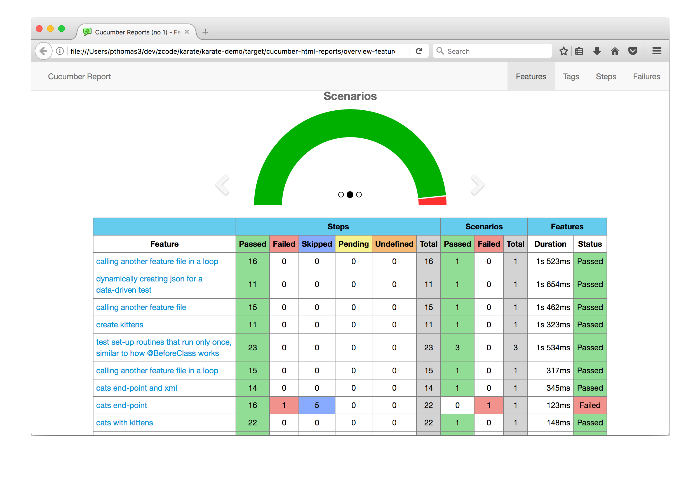

# Karate Demo
This is a sample [Spring Boot](http://projects.spring.io/spring-boot/) web-application that exposes some functionality as web-service end-points. And includes a set of Karate examples that test these services
as well as demonstrate various Karate features and best-practices.

| Example | Demonstrates
----------| --------
[`greeting.feature`](src/test/java/demo/greeting/greeting.feature) | Simple GET requests and multiple scenarios in a test.
[`headers.feature`](src/test/java/demo/headers/headers.feature)  | A simple example of [header management](https://github.com/intuit/karate#configure-headers) using a JS file ([`classpath:headers.js`](src/test/java/headers.js)), and also shows how cookies can be accessed and how path and query parameters can be specified.
[`sign-in.feature`](src/test/java/demo/signin/sign-in.feature) | HTML form POST example. Typically you use the response to get an authentication token that can be used to [build headers](https://github.com/intuit/karate#http-basic-authentication-example) for subsequent requests.
[`cats.feature`](src/test/java/demo/cats/cats.feature) | Great example of [embedded-expressions](https://github.com/intuit/karate#embedded-expressions) (or JSON / XML templating). Also shows how to set the `Accept` [header](https://github.com/intuit/karate#header) for getting XML from the server.
[`kittens.feature`](src/test/java/demo/cats/kittens.feature) | Reading a complex payload expected response [from a file](https://github.com/intuit/karate#reading-files). You can do the same for request payloads as well. Observe how [JSON templating](https://github.com/intuit/karate#embedded-expressions) makes creating dynamic JSON super-easy, look at [line #24](src/test/java/demo/cats/kittens.feature#L24) for example.
[`upload.feature`](src/test/java/demo/upload/upload.feature) | [Multi-part](https://github.com/intuit/karate#multipart-field) file-upload example, as well as comparing the binary content of a download. Also shows how to assert for expected response [headers](https://github.com/intuit/karate#match-header). Plus an example of how to call [custom Java code](https://github.com/intuit/karate#calling-java) from Karate, you can extend this approach to make JDBC calls or do pretty much anything Java can.
[`cats-java.feature`](src/test/java/demo/java/cats-java.feature) | Another example of how to call [Java code](https://github.com/intuit/karate#calling-java) showing how you can pass JSON data around.
[`dynamic-params.feature`](src/test/java/demo/search/dynamic-params.feature) | Using a `Scenario Outline` and `Examples` for data-driven testing. Since the [`params`](https://github.com/intuit/karate#params) keyword takes JSON (and keys with null values are ignored), you can easily script different permutations of query parameters. This example also uses a JavaScript function (to simplify a custom assertion), which is defined in a separate file.
[`call-feature.feature`](src/test/java/demo/callfeature/call-feature.feature) | How you can re-use a sequence of HTTP calls in a `*.feature` file from other test scripts. This is hugely useful for those common authentication or 'set up' flows that create users, etc. Refer to the [main documentation](https://github.com/intuit/karate#calling-other-feature-files) on how you can pass parameters in and get data back from the 'called' script.
[`call-json-array.feature`](src/test/java/demo/callarray/call-json-array.feature) | This example loads JSON data from a file and uses it to call a `*.feature` file in a loop. This approach can enable very dynamic data-driven tests, since there are a variety of ways by which you can create the JSON data, for example by calling custom Java code.
[`call-table.feature`](src/test/java/demo/calltable/call-table.feature) | This is a great example of how Karate combines with Cucumber and JsonPath to give you an extremely readable data-driven test. Karate's [`table`](https://github.com/intuit/karate#table) keyword is a super-elegant and readable way to create JSON arrays, perfect for setting up all manner of data-driven tests.
[`call-dynamic-json.feature`](src/test/java/demo/calldynamic/call-dynamic-json.feature) | Shows how to dynamically create a JSON array and then use it to call a `*.feature` file in a loop. In this example, the JSON is created using a JavaScript function, but it can very well be the response from an HTTP call, the result of a JsonPath expression or even a List of HashMap-s acquired by [calling Java](https://github.com/intuit/karate#calling-java). This test actually calls a second `*.feature` file in a loop to validate a 'get by id'. Using JsonPath and [`match each`](https://github.com/intuit/karate#match-each) to validate all items within a JSON array is also demonstrated.
[`call-once.feature`](src/test/java/demo/callonce/call-once.feature) | Cucumber has a [limitation](https://github.com/cucumber/cucumber-jvm/issues/515) where `Background` steps are re-run for every `Scenario` and even for every `Examples` row within a `Scenario Outline`. This is a problem when you have expensive and time-consuming HTTP calls in your 'set-up' routines. Fortunately you have an elegant work-around with Karate's [`callonce`](https://github.com/intuit/karate#callonce) keyword.
[`polling.feature`](src/test/java/demo/polling/polling.feature) | If you need to keep polling until the response changes to something you expect, you can achieve this by combining JavaScript functions with [calling another `*feature` file](https://github.com/intuit/karate#calling-other-feature-files).
[`JavaApiTest.java`](src/test/java/demo/java/JavaApiTest.java) | If you need to call a Karate test from Java code you can do so using the [Java API](https://github.com/intuit/karate#java-api). This is useful in some situations, for example if you want to mix API-calls into a Selenium / WebDriver test.

## Configuration and Best Practices
| File | Demonstrates
----------| --------
[`karate-config.js`](src/test/java/karate-config.js) | Shows how the `demoBaseUrl` property is injected into all the test scripts on startup. Notice how JavaScript allows you to perform simple conditional logic and string manipulation, while still being a 'devops-friendly' plain-text file. It is good practice to set the `connectTimeout` and `readTimeout` so that your tests 'fail fast' if servers don't respond. Refer to the [main documentation](https://github.com/intuit/karate#configuration) for more on configuration.
[`TestBase.java`](src/test/java/demo/TestBase.java#L22) | This is specific to Spring Boot, but this code takes care of starting the embedded app-server and dynamically chooses a free port. The chosen port value is passed to the above config routine via a Java `System.setProperty()` call.
[`DemoTest.java`](src/test/java/demo/DemoTest.java) | This Java class is strategically placed at the root of the directory structure containing `*.feature` files. Note how the [`@CucumberOptions`](https://cucumber.io/docs/reference/jvm#configuration) annotation allows you to skip any `*.feature` files if they have `@ignore` at the start. The `plugin` option specifies the reports and formats desired, which can be over-ridden on the command-line or by the maven config described below.
[`DemoTestParallel.java`](src/test/java/demo/DemoTestParallel.java) | Karate has a utility to [run tests in parallel](https://github.com/intuit/karate#parallel-execution) and this does not depend on JUnit, TestNG or even Maven. A JUnit XML report file and Cucumber JSON report file would be generated for each feature executed. You can easily configure your CI with the location of these files so that you get proper test-reports after a build. This is now the recommended way of running Karate as part of an automated build or CI pipeline.
[`pom.xml`](pom.xml#L69) | Line 69 shows how the [`maven-surefire-plugin`](http://maven.apache.org/surefire/maven-surefire-plugin/examples/inclusion-exclusion.html) can be configured to point to what is basically your 'test-suite'. You may not even need to do this if you follow the [recommended naming conventions and folder structure](https://github.com/intuit/karate#naming-conventions), and then Maven defaults would work as you would expect. The third-party [maven-cucumber-reporting](https://github.com/damianszczepanik/maven-cucumber-reporting) plugin is being used (optional), and it will generate some nice reports (see screenshot below) in the `target/cucumber-html-reports` folder with the given configuration.

### Example Report

This is an example of using the [maven-cucumber-reporting](https://github.com/damianszczepanik/maven-cucumber-reporting) plugin along with the [Karate parallel runner](https://github.com/intuit/karate#parallel-execution). You can generate this report with just a few extra lines of maven config.

 

