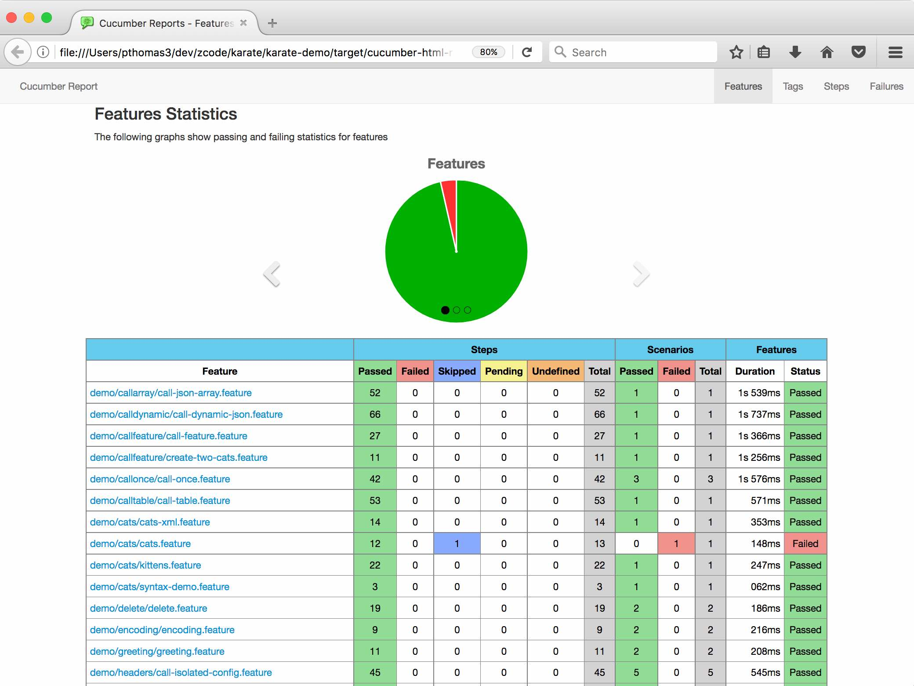
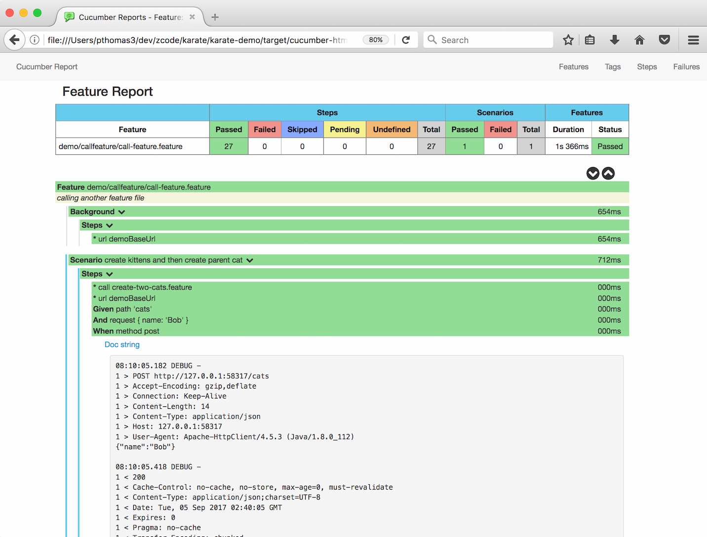
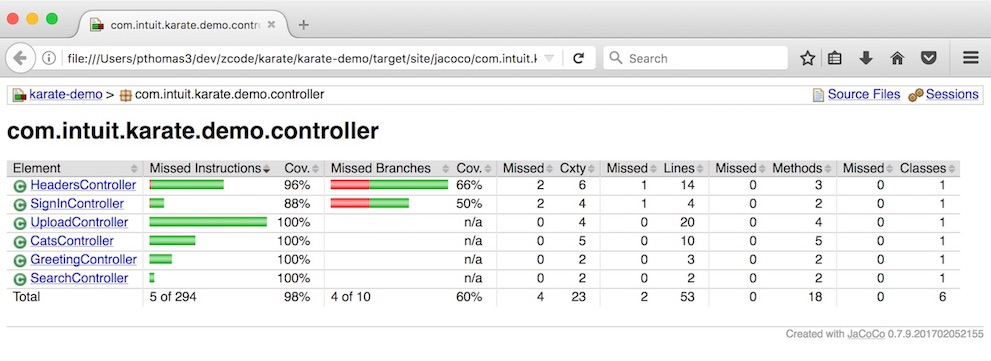

# Karate Demo
This is a sample [Spring Boot](http://projects.spring.io/spring-boot/) web-application that exposes some functionality as web-service end-points. And includes a set of Karate examples that test these services as well as demonstrate various Karate features and best-practices. 

Note that this is *not* the best example of a skeleton Java / Maven project, as it is designed to be part of the Karate code-base and act as a suite of regression tests. For a good "starter" project, please use one of these:
* the [Quickstart](https://github.com/intuit/karate#quickstart)
* the sample [Spring Boot Example](https://github.com/intuit/karate#spring-boot-example)
* the [examples/jobserver](../examples/jobserver) project

| Example | Demonstrates
----------| --------
[`greeting.feature`](src/test/java/demo/greeting/greeting.feature) | Simple GET requests and multiple scenarios in a test.
[`headers.feature`](src/test/java/demo/headers/headers.feature)  | Multiple examples of [header management](https://github.com/intuit/karate#configure-headers) including dynamic setting of headers for each request using a JS file ([`classpath:headers.js`](src/test/java/headers.js)). Also demonstrates handling of cookies, and path / query parameters. There are also examples of how to set up a [re-usable `*.feature file`](src/test/java/demo/headers/call-updates-config.feature) for per-request secure / auth headers after a sign-in. [OAuth 2](src/test/java/demo/oauth/oauth2.feature), [OAuth 1](src/test/java/demo/oauth/oauth1.feature) and [JWT](src/test/java/demo/jwt/jwt.feature) samples are also available.
[`sign-in.feature`](src/test/java/demo/signin/sign-in.feature) | HTML form POST example. Typically you use the response to get an authentication token that can be used to [build headers](https://github.com/intuit/karate#http-basic-authentication-example) for subsequent requests. This example also demonstrates getting past an end-point protected against [CSRF](https://docs.spring.io/spring-security/site/docs/current/reference/html/csrf.html).
[`cats.feature`](src/test/java/demo/cats/cats.feature) | Great example of [embedded-expressions](https://github.com/intuit/karate#embedded-expressions) (or JSON / XML templating). Also shows how to set the `Accept` [header](https://github.com/intuit/karate#header) for getting XML from the server.
[`kittens.feature`](src/test/java/demo/cats/kittens.feature) | Reading a complex payload expected response [from a file](https://github.com/intuit/karate#reading-files). You can do the same for request payloads as well.
[`read-files.feature`](src/test/java/demo/read/read-files.feature) | The above example reads a file with [embedded expressions](https://github.com/intuit/karate#embedded-expressions) and this one reads normal JSON and XML for use in a [`match`](https://github.com/intuit/karate#match). Also a good example of using the [`set`](https://github.com/intuit/karate#set) and [`table`](https://github.com/intuit/karate#table) keywords to build JSON (or XML) payloads from scratch.
[`graphql.feature`](src/test/java/demo/graphql/graphql.feature) | GraphQL example showing how easy it is to prepare queries and deal with the highly dynamic and deeply nested JSON responses - by focusing only on the parts you are interested in
[`upload.feature`](src/test/java/demo/upload/upload.feature) | [Multi-part](https://github.com/intuit/karate#multipart-field) file-upload example, as well as comparing the binary content of a download. Also shows how to assert for expected response [headers](https://github.com/intuit/karate#match-header). Plus an example of how to call [custom Java code](https://github.com/intuit/karate#calling-java) from Karate.
[`dogs.feature`](src/test/java/demo/dogs/dogs.feature) | How to easily use [Java interop](https://github.com/intuit/karate#calling-java) to make a JDBC / database call from a Karate test. Here is the utility-class code - which depends on [Spring JDBC](https://docs.spring.io/spring/docs/current/spring-framework-reference/html/jdbc.html#jdbc-JdbcTemplate): [`DbUtils.java`](src/main/java/com/intuit/karate/demo/util/DbUtils.java). The same approach can be used to mix things like Selenium or WebDriver into Karate. Also see this [gRPC](https://grpc.io) [example](https://thinkerou.com/karate-grpc/) by [@thinkerou](https://github.com/thinkerou).
[`cats-java.feature`](src/test/java/demo/java/cats-java.feature) | Another example of how to call [Java code](https://github.com/intuit/karate#calling-java) showing how you can pass JSON data around.
[`schema.feature`](src/test/java/demo/schema/schema.feature) | Karate's [simpler approach](https://github.com/intuit/karate#schema-validation) to schema-validation [compared with](https://twitter.com/KarateDSL/status/878984854012022784) an actual JSON-schema example taken from [json-schema.org](http://json-schema.org/example1.html). If you really want to perform JSON-schema validation, this example shows you how you can easily do so using [Java interop](https://github.com/intuit/karate#calling-java) and the [json-schema-validator](https://github.com/java-json-tools/json-schema-validator), but should you really ?
[`first.feature`](src/test/java/demo/tags/first.feature) | Along with [`second.feature`](src/test/java/demo/tags/second.feature) shows how you can use [tags](https://github.com/intuit/karate#tags) to selectively run tests or groups of tests from the command-line.
[`soap.feature`](src/test/java/demo/soap/soap.feature) | Examples for both [SOAP](https://github.com/intuit/karate#soap) 1.1 and 1.2, also showing how you can [read](https://github.com/intuit/karate#reading-files) request payloads and even expected response XML from files. Note that examples of how to manipulate XML are linked from the [main documentation](https://github.com/intuit/karate#advanced-xpath) - for example this one: [`xml.feature`](../karate-junit4/src/test/java/com/intuit/karate/junit4/xml/xml.feature)
[`dynamic-params.feature`](src/test/java/demo/search/dynamic-params.feature) | Multiple examples of data-driven testing including using a `Scenario Outline` and `Examples` - so that you can compare approaches. Since the [`params`](https://github.com/intuit/karate#params) keyword takes JSON (and keys with null values are ignored), you can easily script different permutations of query parameters. This example also uses a JavaScript function (to simplify a custom assertion), which is defined in a separate file.
[`outline.feature`](../karate-junit4/src/test/java/com/intuit/karate/junit4/demos/outline.feature) | The Karate [enhanced `Scenario Outline`](https://github.com/intuit/karate#scenario-outline-enhancements) makes data-driven tests JSON-friendly.
[`dynamic-csv.feature`](src/test/java/demo/outline/dynamic-csv.feature) | Using CSV for a data-driven [dynamic scenario outline](https://github.com/intuit/karate#dynamic-scenario-outline).
[`cat.feature`](src/test/java/demo/unit/cat.feature) | So you like Karate's data-driven and assertion capabilities ? Try Karate for [unit testing Java code](https://twitter.com/ptrthomas/status/1132515667310047233) ! You can re-use the [glue code](src/test/java/demo/unit/common.feature) in multiple tests.
[`call-feature.feature`](src/test/java/demo/callfeature/call-feature.feature) | How you can re-use a sequence of HTTP calls in a `*.feature` file from other test scripts. This is hugely useful for those common authentication or 'set up' flows that create users, etc. Refer to the [main documentation](https://github.com/intuit/karate#calling-other-feature-files) on how you can pass parameters in and get data back from the 'called' script.
[`call-json-array.feature`](src/test/java/demo/callarray/call-json-array.feature) | This example loads JSON data from a file and uses it to call a `*.feature` file in a loop. This approach can enable very dynamic data-driven tests, since there are a variety of ways by which you can create the JSON data, for example by calling custom Java code.
[`call-table.feature`](src/test/java/demo/calltable/call-table.feature) | This is a great example of how Karate combines with Cucumber and JsonPath to give you an extremely readable data-driven test. Karate's [`table`](https://github.com/intuit/karate#table) keyword is a super-elegant and readable way to create JSON arrays, perfect for setting up all manner of data-driven tests.
[`call-dynamic-json.feature`](src/test/java/demo/calldynamic/call-dynamic-json.feature) | Shows how to dynamically create a JSON array and then use it to call a `*.feature` file in a loop. In this example, the JSON is created using a JavaScript function, but it can very well be the response from an HTTP call, the result of a JsonPath expression or even a List of HashMap-s acquired by [calling Java](https://github.com/intuit/karate#calling-java). This test actually calls a second `*.feature` file in a loop to validate a 'get by id'. Using JsonPath and [`match each`](https://github.com/intuit/karate#match-each) to validate all items within a JSON array is also demonstrated.
[`call-once.feature`](src/test/java/demo/callonce/call-once.feature) | Cucumber has a [limitation](https://github.com/cucumber/cucumber-jvm/issues/515) where `Background` steps are re-run for every `Scenario` and even for every `Examples` row within a `Scenario Outline`. This is a problem when you have expensive and time-consuming HTTP calls in your 'set-up' routines. Fortunately you have an elegant work-around with Karate's [`callonce`](https://github.com/intuit/karate#callonce) keyword.
[`polling.feature`](src/test/java/demo/polling/polling.feature) | [Retry support](https://github.com/intuit/karate#retry-until) is built-in to Karate, but you can also achieve this by combining JavaScript functions with a [`call` to another `*.feature` file](https://github.com/intuit/karate#calling-other-feature-files).
[`websocket.feature`](src/test/java/demo/websocket/websocket.feature) | How to write [websocket](https://github.com/intuit/karate#websocket) tests, also see [`echo.feature`](src/test/java/demo/websocket/echo.feature).
[`JavaApiTest.java`](src/test/java/demo/java/JavaApiTest.java) | If you need to call a Karate test from Java code you can do so using the [Java API](https://github.com/intuit/karate#java-api). This is useful in some situations, for example if you want to mix API-calls into a Selenium / WebDriver test.

## Configuration and Best Practices
| File | Demonstrates
----------| --------
[`karate-config.js`](src/test/java/karate-config.js) | Shows how the `demoBaseUrl` property is injected into all the test scripts [on startup](https://github.com/intuit/karate#configuration). Notice how JavaScript allows you to perform simple conditional logic and string manipulation, while still being a 'devops-friendly' plain-text file. It is good practice to set the `connectTimeout` and `readTimeout` so that your tests 'fail fast' if servers don't respond. For advanced users - you can even run a 'global' init routine using [`karate.callSingle()`](https://github.com/intuit/karate#the-karate-object).
[`karate-config-contract.js`](src/test/java/karate-config-contract.js) | When your project gets complex, you can over-ride config per environment ([`karate.env`](https://github.com/intuit/karate#configuration)). Refer to the documentation on [environment specific config](https://github.com/intuit/karate#environment-specific-config).
[`TestBase.java`](src/test/java/demo/TestBase.java) | This is specific to Spring Boot, but this code takes care of starting the embedded app-server and dynamically chooses a free port. The chosen port value is passed to the above config routine via a Java `System.setProperty()` call.
[`DemoTest.java`](src/test/java/demo/DemoTest.java) | This Java class is strategically placed at the root of the [directory structure](https://github.com/intuit/karate#naming-conventions) containing `*.feature` files. Note how the `@KarateOptions` annotation allows you to skip any `*.feature` files if they have `@ignore` at the start.
[`DemoTestParallel.java`](src/test/java/demo/DemoTestParallel.java) | Karate has a utility to [run tests in parallel](https://github.com/intuit/karate#parallel-execution) and this does not depend on JUnit, TestNG or even Maven. A JUnit XML report file and Cucumber JSON report file would be generated for each feature executed. You can easily configure your CI with the location of these files so that you get proper test-reports after a build. This is **the** recommended way of running Karate as part of an automated build or CI pipeline. Here, the (optional) third-party [cucumber-reporting](https://github.com/damianszczepanik/cucumber-reporting) library is being used (see details below).
[`pom.xml`](pom.xml) | Look out for how the [`maven-surefire-plugin`](http://maven.apache.org/surefire/maven-surefire-plugin/examples/inclusion-exclusion.html) can be configured to point to what is basically your 'test-suite'. You may not even need to do this if you follow the [recommended naming conventions and folder structure](https://github.com/intuit/karate#naming-conventions), and then Maven defaults would work as you would expect. Note that this demo application has many dependencies that you will *not* need for a typical Karate project.

## Gradle
This project contains an example [`build.gradle`](build.gradle) that can be used as a reference by Gradle users who want to use the [recommended directory structure](https://github.com/intuit/karate#naming-conventions).

To generate the Gradle wrapper (as is usual for Gradle):

```
gradle wrapper
```

After that use the Gradle wrapper to run the tests:

```
./gradlew test
```

## Example Report
> This is optional and if you use the parallel runner as described above, the JUnit XML emitted is sufficient for most CI tools (e.g. Jenkins) to generate test reports and determine whether the build passed or failed. But the advantage of the approach below is that it includes HTTP request and response logs in-line with the report (see [video](https://twitter.com/KarateDSL/status/899671441221623809)).

Since the [maven-cucumber-reporting](https://github.com/damianszczepanik/maven-cucumber-reporting) plugin [has an issue](https://github.com/damianszczepanik/maven-cucumber-reporting/issues/61#issuecomment-310815425) where reports will not be generated if the build fails, we recommend that you directly use the [cucumber-reporting](https://github.com/damianszczepanik/cucumber-reporting) library programmatically in combination with the [Karate parallel runner](https://github.com/intuit/karate#parallel-execution). Here is how:

### Maven Dependency
Add the `net.masterthought:cucumber-reporting` jar as a dependency in `test` scope
```xml
<dependency>
    <groupId>net.masterthought</groupId>
    <artifactId>cucumber-reporting</artifactId>
    <version>3.8.0</version>
    <scope>test</scope>
</dependency>
```

### Log4j Config File
If you don't already have log4j (v2) in the mix, place this minimal config on the classpath as `log4j2.properties` (in the same folder as `karate-config.js`).
```
log4j.rootLogger = INFO, CONSOLE
log4j.appender.CONSOLE = org.apache.log4j.ConsoleAppender
log4j.appender.CONSOLE.layout = org.apache.log4j.PatternLayout
```

### Generate Report
Refer to the code in the demo: [`DemoTestParallel.java`](src/test/java/demo/DemoTestParallel.java#L43), specifically the `generateReport()` method.

And here is the output, which goes into `target/cucumber-html-reports` if you follow the above steps:



This report is recommended especially because the HTTP request and response payloads are embedded. You can even see the results of [`print`](https://github.com/intuit/karate#print) statements in-line.



## Code Coverage using Jacoco
In the [`pom.xml`](pom.xml#L160), code coverage using [Jacoco](http://www.baeldung.com/jacoco) is also demonstrated. Since this is set-up as a [Maven profile](http://maven.apache.org/guides/introduction/introduction-to-profiles.html), instrumentation and code-coverage reporting would be performed only when you use the `coverage` profile. Note that code-coverage data (binary) would be saved to this file: `target/jacoco.exec`.

So to run tests and perform code-coverage:

```
mvn clean test -Pcoverage
```

 And the HTML reports would be output to `target/site/jacoco/index.html`.



As this demo example shows - if you are able to start your app-server and run Karate tests in the same JVM process, code-coverage reports for even HTTP integration tests will be very easy to generate. This is even easier with the [karate-mock-servlet](../karate-mock-servlet) as you don't even need to boot an app-server.

## Code Coverage for non-Java Projects
This has been demonstrated for JavaScript by [Kirk Slota](https://twitter.com/kirk_slota). You can find a working sample here: [`karate-istanbul`](https://github.com/kirksl/karate-istanbul) - and you can read the [discussion at Stack Overflow](https://stackoverflow.com/q/59977566/143475) for more details.

You should be able to use the same approach for other platforms. Note that there are plenty of ways to start a Karate test via the command-line, such as the [standalone JAR](https://github.com/intuit/karate/tree/master/karate-netty#standalone-jar).

