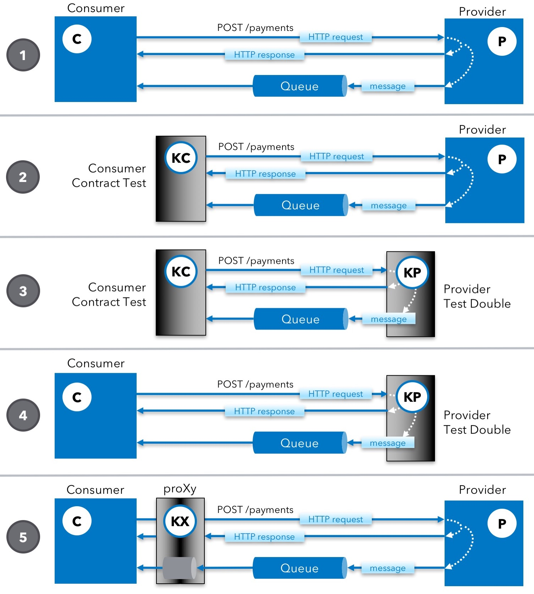

# Karate Netty
## API Test-Doubles Made `Simple.`
And [Consumer Driven Contracts](https://martinfowler.com/articles/consumerDrivenContracts.html) made easy.

# Index

<table>
<tr>
  <th>Start</th>
  <td>
      <a href="#standalone-jar">Standalone JAR</a>
    | <a href="#downloading">Downloading</a>
    | <a href="#quick-start">Quick Start</a>
    | <a href="#usage">Usage</a>
    | <a href="#logging">Logging</a>
    | <a href="#the-worlds-smallest-microservice-">The World's Smallest Microservice</a>
  </td>
</tr>
<tr>
  <th>Life Cycle</th>
  <td>
      <a href="#embedding">Java / JUnit</a>
    | <a href="#within-a-karate-test">Within a Karate Test</a>  
    | <a href="#background"><code>Background</code></a>
    | <a href="#scenario"><code>Scenario</code></a>
    | <a href="#stopping">Stopping</a>
  </td>
</tr>
<tr>
  <th>Request</th>
  <td>
      <a href="#request"><code>request</code></a>
    | <a href="#requestbytes"><code>requestBytes</code></a>
    | <a href="#requesturlbase"><code>requestUrlBase</code></a>
    | <a href="#requesturi"><code>requestUri</code></a>
    | <a href="#requestmethod"><code>requestMethod</code></a>
    | <a href="#requestheaders"><code>requestHeaders</code></a>
    | <a href="#requestparams"><code>requestParams</code></a>
    | <a href="#pathmatches"><code>pathMatches()</code></a>
    | <a href="#pathparams"><code>pathParams</code></a>
    | <a href="#methodis"><code>methodIs()</code></a>
    | <a href="#paramexists"><code>paramExists()</code></a>
    | <a href="#paramvalue"><code>paramValue()</code></a>
    | <a href="#typecontains"><code>typeContains()</code></a>
    | <a href="#acceptcontains"><code>acceptContains()</code></a>
    | <a href="#headercontains"><code>headerContains()</code></a>
    | <a href="#bodypath"><code>bodyPath()</code></a>
  </td>
</tr>
<tr>
  <th>Response</th>
  <td>
      <a href="#response"><code>response</code></a>
    | <a href="#responsestatus"><code>responseStatus</code></a>
    | <a href="#responseheaders"><code>responseHeaders</code></a>
    | <a href="#responsedelay"><code>responseDelay</code></a>
    | <a href="#afterscenario"><code>afterScenario</code></a>
    | <a href="#karateabort"><code>karate.abort()</code></a>
    | <a href="#responsestatus"><code>responseStatus</code></a>
  </td>
</tr>
<tr>
  <th>Advanced</th>
  <td>
      <a href="#configure-cors"><code>configure cors</code></a>
    | <a href="#configure-responsedelay"><code>configure responseDelay</code></a>    
    | <a href="#configure-afterscenario"><code>configure afterScenario</code></a>
    | <a href="#configure-responseheaders"><code>configure responseHeaders</code></a>    
    | <a href="#proxy-mode"><code>Proxy Mode</code></a>
    | <a href="#karateabort"><code>karate.abort()</code></a>
    | <a href="#karateproceed"><code>karate.proceed()</code></a>
    | <a href="#consumer-provider-example"><code>Consumer Driven Contracts</code></a>       
  </td>
</tr>
</table>

### Capabilities
* Everything on `localhost` or within your network, no need to worry about your data leaking into the cloud
* Super-easy 'hard-coded' mocks ([example](../karate-junit4/src/test/java/com/intuit/karate/mock/_mock.feature))
* Stateful mocks that can fully simulate CRUD for a micro-service ([example](../karate-demo/src/test/java/mock/proxy/demo-mock.feature))
* Not only JSON but first-class support for XML, plain-text, binary, etc.
* Convert JSON or XML into dynamic responses with ease
* Maintain and read large payloads from the file-system if needed
* Mocks are plain-text files - easily collaborate within or across teams using Git / SCM
* Easy HTTP request matching by path, method, headers, body etc.
* Use the full power of JavaScript expressions for HTTP request matching
* SSL / HTTPS with built-in self-signed certificate
* Forward HTTP requests to other URL-s (URL re-writing)
* Usable as a standard HTTP proxy server - simplifying configuration set-up for consuming applications
* Start and stop mock servers in milliseconds
* Super-fast HTTP response times (~20ms) for typical in-memory CRUD / JsonPath (as long as you don't do I/O)
* Thread-safe - use concurrent consumers or async flows without fear
* Simulate [slow, delayed](), error or malformed responses with ease
* Zero errors even under load / stress - see this [benchmark comparison with other tools](https://twitter.com/KarateDSL/status/1083775218873581571)
* Easy integration into Java / JUnit test-suites via API
* Server can dynamically choose free port
* Think of it as a scriptable 'API gateway' or 'AOP for web-services' - insert custom functions before / after an HTTP request is handled
* Just *one* file can script the above aspects, simplifying the mental-model you need to have for advanced scenarios such as [Consumer Driven Contracts](https://martinfowler.com/articles/consumerDrivenContracts.html)
* Easily integrate messaging or async flows using Java-interop if required
* Enables consumer or even UI dev teams to work in parallel as the provider service is being developed
* [Stand-alone executable JAR](#standalone-jar) (25 MB) which only requires a JRE to run, ideal for web-developers or anyone who needs to quickly experiment with services.
* Built-in [CORS](#configure-cors) support for the ease of web-dev teams using the mock service
* Option to use an existing certificate and private-key for server-side SSL - making it easier for UI dev / browser consumers in some situations
* Configure a 'global' response header routine, ideal for browser consumers to add headers common for *all* responses - yet dynamic if needed
* Provider service dev team can practice TDD using the mock + contract-test
* The mock + contract-test serves as the ultimate form of documentation of the 'contract' including payload / schema details

## Using
Note that you can use this as a [stand-alone JAR executable](#standalone-jar) which means that you don't even need to compile Java or use an IDE. If you need to embed the mock-server into a JUnit test, you can easily do so.

### Maven
The [Netty](https://netty.io) based capabilities are included when you use `karate-apache` (or `karate-jersey`), so there is no extra dependency needed besides what is outlined in the [main documentation](https://github.com/intuit/karate#maven).

## Consumer-Provider Example



We use a simplified example of a Java 'consumer' which makes HTTP calls to a Payment Service (provider) where `GET`, `POST`, `PUT` and `DELETE` have been implemented. The 'provider' implements CRUD for the [`Payment.java`](../karate-demo/src/test/java/mock/contract/Payment.java) 'POJO', and the `POST` (or create) results in a message ([`Shipment.java`](../karate-demo/src/test/java/mock/contract/Shipment.java) as JSON) being placed on a queue, which the consumer is listening to.

[ActiveMQ](http://activemq.apache.org) is being used for the sake of mixing an asynchronous flow into this example, and with the help of some [simple](../karate-demo/src/test/java/mock/contract/QueueUtils.java) [utilities](../karate-demo/src/test/java/mock/contract/QueueConsumer.java), we are able to mix asynchronous messaging into a Karate test *as well as* the test-double. Also refer to the documentation on [handling async flows in Karate](https://github.com/intuit/karate#async).

A simpler stand-alone example (without ActiveMQ / messaging) is also available here: [`examples/consumer-driven-contracts`](../examples/consumer-driven-contracts). This is a stand-alone Maven project for convenience, and you just need to clone or download a ZIP of the Karate source code to get it. You can compare and contrast this example with how other frameworks approach [Consumer Driven Contract](https://www.thoughtworks.com/radar/techniques/consumer-driven-contract-testing) testing.

| Key    | Source Code | Description |
| ------ | ----------- | ----------- |
C | [`Consumer.java`](../karate-demo/src/test/java/mock/contract/Consumer.java) | The 'consumer' or client application that consumes the demo 'Payment Service' and also listens to a queue
P | [`PaymentService.java`](../karate-demo/src/test/java/mock/contract/PaymentService.java) | The provider 'Payment Service'
1 | [`ConsumerIntegrationTest.java`](../karate-demo/src/test/java/mock/contract/ConsumerIntegrationTest.java) | An end-to-end integration test of the consumer that needs the *real* provider to be up and running
KC | [`payment-service.feature`](../karate-demo/src/test/java/mock/contract/payment-service.feature) | A 'normal' Karate functional-test that tests the 'contract' of the Payment Service from the perspective of the consumer
2 | [`PaymentServiceContractTest.java`](../karate-demo/src/test/java/mock/contract/PaymentServiceContractTest.java) | JUnit runner for the above Karate 'contract' test, that depends on the *real* provider being up and running
KP | [`payment-service-mock.feature`](../karate-demo/src/test/java/mock/contract/payment-service-mock.feature) | A 'state-ful' mock (or stub) that *fully* implements the 'contract' ! Yes, *really*.
3 | [`PaymentServiceContractUsingMockTest.java`](../karate-demo/src/test/java/mock/contract/PaymentServiceContractUsingMockTest.java) | Uses the above 'stub' to run the Payment Service 'contract' test
4 | [`ConsumerUsingMockTest.java`](../karate-demo/src/test/java/mock/contract/ConsumerUsingMockTest.java) | Uses the 'fake' Payment Service 'stub' to run an integration test for the *real* consumer
KX | [`payment-service-proxy.feature`](../karate-demo/src/test/java/mock/contract/payment-service-proxy.feature) | Karate can act as a proxy with 'gateway like' capabilities, you can choose to either stub a response or delegate to a remote provider, depending on the incoming request. Think of the 'X' as being able to *transform* the HTTP request and response payloads as they pass through (and before returning)
5a | [`ConsumerUsingProxyHttpTest.java`](../karate-demo/src/test/java/mock/contract/ConsumerUsingProxyHttpTest.java) | Here Karate is set up to act as an HTTP proxy, the advantage is that the consumer can use the 'real' provider URL, which simplifies configuration, provided that you can configure the consumer to use an HTTP proxy (ideally in a non-invasive fashion)
5b | [`ConsumerUsingProxyRewriteTest.java`](../karate-demo/src/test/java/mock/contract/ConsumerUsingProxyRewriteTest.java) | Karate acts as a URL 're-writing' proxy. Here the consumer 'knows' only about the proxy. In this mode (as well as the above 'HTTP proxy' mode which uses the *same* script file), you can choose to either stub a response - or even forward the incoming HTTP request onto any remote URL you choose.

> Karate mocking a Queue has not been implemented for the last two flows (5) but can easily be derived from the other examples. So in (5) the Consumer is using the *real* queue.

Also see this [blog post](https://hackernoon.com/api-consumer-contract-tests-and-test-doubles-with-karate-72c30ea25c18) for an additional diagram explaining how a mock-service can be implemented.

### Server-Side Karate
#### A perfect match !
It is worth calling out *why* Karate on the 'other side of the fence' (*handling* HTTP requests instead of *making* them) - turns out to be remarkably effective, yet simple.

* 'Native' support for expressing JSON and XML payloads
* [Embedded Expressions](https://github.com/intuit/karate#embedded-expressions) are perfect for those parts of the payload that need to be dynamic, and JS functions can be 'in-lined' into the JSON or XML
* Manipulate or even transform payloads
* Validate payloads if needed, using a [simpler alternative to JSON schema](https://twitter.com/KarateDSL/status/878984854012022784)
* Karate is *all* about making HTTP calls, giving you the flexibility to call 'downstream' services if needed
* In-memory JSON and JsonPath solves for ['state' and filtering](https://twitter.com/KarateDSL/status/946607931327266816) if needed
* Mix [custom JavaScript (or even Java code)](https://github.com/intuit/karate#karate-expressions) if needed - for complex logic
* Easily 'seed' data or switch environment / config on start
* Read initial 'state' from a JSON file if needed

If you think about it, all the above are *sufficient* to implement *any* micro-service. Karate's DSL syntax is *focused* on exactly these aspects, thus opening up interesting possibilities. It may be hard to believe that you can spin-up a 'usable' micro-service in minutes with Karate - but do try it and see !

# Standalone JAR
*All* of Karate (core API testing, parallel-runner / HTML reports, the debugger-UI, mocks and web / UI automation) is available as a *single*, executable JAR file, which includes even the [`karate-apache`](https://mvnrepository.com/artifact/com.intuit.karate/karate-apache) dependency. This is ideal for handing off to UI / web-dev teams for example, who don't want to mess around with a Java IDE. And there is a [Visual Studio Code plugin](https://marketplace.visualstudio.com/items?itemName=kirkslota.karate-runner) that supports the Karate standalone JAR.

The only pre-requisite is the [Java Runtime Environment](http://www.oracle.com/technetwork/java/javase/downloads/index.html). Note that the "lighter" JRE is sufficient, not the JDK / Java Development Kit. At least version 1.8.0_112 or greater is required, and there's a good chance you already have Java installed. Check by typing `java -version` on the command line.

## Downloading
Note that the [ZIP Release](#quick-start) is recommended for those new to Karate - or who don't have much programming experience. If you are just looking for the single JAR file or executable, please read on.

> Tip: Rename the file to `karate.jar` to make the [commands](#usage) easier to type !

Look for the file with the name: `karate-<version>.jar`:

* Option 1: Download from Bintray: [https://dl.bintray.com/ptrthomas/karate/](https://dl.bintray.com/ptrthomas/karate/)
* Option 2: Look for the [latest release](https://github.com/intuit/karate/releases) on GitHub and scroll down to find the "Assets"

## Quick Start
Just use the [ZIP release](https://github.com/intuit/karate/wiki/ZIP-Release) and follow the insructions under the heading: [API Mocks](https://github.com/intuit/karate/wiki/ZIP-Release#api-mocks).

Also try the ["World's Smallest MicroService"](#the-worlds-smallest-microservice-) !

## Usage
### Help
You can view the command line help with the `-h` option:
```
java -jar karate.jar -h
```

### Mock Server
To start a mock server, the 2 mandatory arguments are the path of the feature file 'mocks' `-m` and the port `-p`

```
java -jar karate.jar -m my-mock.feature -m my-2nd-mock.feature -p 8080
```

Note that this server will be able to act as an HTTPS proxy server if needed. If you need to specify a custom certificate and key combination, see below.

#### SSL
For SSL, use the `-s` flag. If you don't provide a certificate and key (see next section), it will automatically create `cert.pem` and `key.pem` in the current working directory, and the next time you re-start the mock server - these will be re-used. This is convenient for web / UI developers because you then need to set the certificate 'exception' only once in the browser.

```
java -jar karate.jar -m my-mock.feature -p 8443 -s
```

If you have a custom certificate and private-key (in PEM format) you can specify them, perhaps because these are your actual certificates or because they are trusted within your organization.

```
java -jar karate.jar -m my-mock.feature -p 8443 -s -c my-cert.crt -k my-key.key
```

If you *don't* enable SSL, the proxy server will still be able to tunnel HTTPS traffic - and will use the certificate / key combination you specify or auto-create `cert.pem` and `key.pem` as described above.

```
java -jar karate.jar -m my-mock.feature -p 8090 -c my-cert.crt -k my-key.key
```

#### Hot Reload
You can hot-reload a mock feature file for changes by adding the `-w` or `--watch` option.

### Running Tests
Convenient to run standard [Karate](https://github.com/intuit/karate) tests on the command-line without needing to mess around with Java or the IDE ! Great for demos or exploratory testing. Even HTML reports are generated !

Feature files (or search paths) to be tested don't need command-line flags or options and can be just listed at the end of the command.

```
java -jar karate.jar my-test.feature
```
#### Custom Classpath
Karate allows you to use custom Java code or 3rd party Java libraries using [Java interop](https://github.com/intuit/karate#calling-java). Normally those who do this use Karate in the context of [Maven](https://maven.apache.org) or [Gradle](https://gradle.org) - and the [classpath](https://github.com/intuit/karate#classpath) would be set automatically.

You can use the standalone JAR and still depend on external Java code - but you have to set the classpath for this to work. The entry-point for the Karate command-line app is `com.intuit.karate.Main`. Here is an example of using the [Karate Robot](https://github.com/intuit/karate/tree/master/karate-robot) library [as a JAR file](https://github.com/intuit/karate/wiki/ZIP-Release#karate-robot) assuming it is in the current working directory.

```
java -cp karate.jar:karate-robot.jar com.intuit.karate.Main test.feature
```

If on Windows, note that the path-separator is `;` instead of `:` as seen above for Mac / Linux. Refer this [post](https://stackoverflow.com/a/56458094/143475) for more details.

This approach is useful if you are trying to point the standalone Karate JAR file to a project structure that comes from the Java / Maven world. And the [`karate-config.js`](https://github.com/intuit/karate#configuration) will be looked for in the classpath itself.

#### Scenario Name
If you only want to run a single `Scenario` by name, use the `-n` or `--name` option:

```
java -jar karate.jar -n "^some name$" my-test.feature
```

Note that you can run a single `Scenario` by line number - by appending it at the end of the feature name with a colon character. For `Scenario Outline`-s, you can even select a single `Examples` row by line-number.

```
java -jar karate.jar my-test.feature:42
```

#### Tags
You can specify [Cucumber tags](https://github.com/intuit/karate#cucumber-tags) to include (or exclude) using the `-t` or `--tags`  option as follows:

```
java -jar karate.jar -t @smoke,~@ignore my-test.feature
```

#### `karate.env`
If your test depends on the `karate.env` [environment 'switch'](https://github.com/intuit/karate#switching-the-environment), you can specify that using the `-e` (env) option:

```
java -jar karate.jar -e e2e my-test.feature
```

#### `karate-config.js`
If [`karate-config.js`](https://github.com/intuit/karate#configuration) exists in the current working directory, it will be used. You can specify a full path by setting the system property `karate.config.dir`. Note that this is an easy way to set a bunch of variables, just return a JSON with the keys and values you need.

```
java -Dkarate.config.dir=parentdir/somedir -jar karate.jar my-test.feature
```

If you want to pass any custom or environment variables, make sure they are *before* the `-jar` part else they will not be passed to the JVM. For example:

```cucumber
java -Dfoo=bar -Dbaz=ban -jar karate.jar my-test.feature
```

And now you can get the value of `foo` from JavaScript or a [Karate expression](https://github.com/intuit/karate#karate-expressions) as follows:

```javascript
var foo = karate.properties['foo']
```

#### Parallel Execution
If you provide a directory in which multiple feature files are present (even in sub-folders), they will be all run. You can even specify the number of threads to run in parallel using `-T` or `--threads` (not to be confused with `-t` for tags):

```
java -jar karate.jar -T 5 -t ~@ignore src/features
```

#### Output Directory
The output directory where the `karate.log` file, JUnit XML and Cucumber report JSON files would be output will default to `target` in the current working directory. The Cucumber HTML report would be found in a folder called `cucumber-html-reports` within this "output" folder. You can change the output folder using the `-o` or `--output` option:

```
java -jar karate.jar -T 5 -t ~@ignore -o /my/custom/dir src/features
```

#### Clean
The [output directory](#output-directory) will be deleted before the test runs if you use the `-C` or `--clean` option.

```
java -jar karate.jar -T 5 -t ~@ignore -C src/features
```

#### Debug Server
The `-d` or `--debug` option will start a debug server. See the [Debug Server wiki](https://github.com/intuit/karate/wiki/Debug-Server#standalone-jar) for more details.


## Logging
A default [logback configuration file](https://logback.qos.ch/manual/configuration.html) (named [`logback-netty.xml`](src/main/resources/logback-netty.xml)) is present within the stand-alone JAR. If you need to customize logging, set the system property `logback.configurationFile` to point to your custom config:
```
java -jar -Dlogback.configurationFile=my-logback.xml karate.jar my-test.feature
```
Here is the 'out-of-the-box' default which you can customize. Note that the default creates a folder called `target` and within it, logs will be in `karate.log`.

Note that MDC's `karateRequestId` can be used to correlate log statements against response `X-Karate-Request-Id` header.

```xml
<?xml version="1.0" encoding="UTF-8"?>
<configuration>
 
    <appender name="STDOUT" class="ch.qos.logback.core.ConsoleAppender">
        <encoder>
            <pattern>%d{HH:mm:ss.SSS} [%thread] %mdc{karateRequestId} %-5level %logger{36} - %msg%n</pattern>
        </encoder>
    </appender>
  
    <appender name="FILE" class="ch.qos.logback.core.FileAppender">
        <file>${karate.output.dir}/karate.log</file>
        <encoder>
            <pattern>%d{HH:mm:ss.SSS} [%thread] %mdc{karateRequestId} %-5level %logger{36} - %msg%n</pattern>
        </encoder>
    </appender>    
   
    <logger name="com.intuit.karate" level="DEBUG"/>
   
    <root level="warn">
        <appender-ref ref="STDOUT" />
        <appender-ref ref="FILE" />
    </root>
  
</configuration>
```

# Embedding
Starting and stopping a Karate server can be done via the Java API and this easily allows you to mix Karate into Java code, JUnit tests and Continuous Integration pipelines.

The `com.intuit.karate.netty.FeatureServer` class has a static `start()` method that takes 4 arguments:
*  Feature file(s)
    * `file`: a `java.io.File` reference to the `*.feature` file you want to run as a server 
    * `files`: a `List<java.io.File>` as above, if you have multiple
* `port`: `int` value of the port you want to use. `0` means, Karate will dynamically choose a free port (the value of which you can retrieve later)
* `ssl`: `boolean` flag that if true, starts an HTTPS server and auto-generates a certificate if it doesn't find one, see [SSL](#ssl)
* `arg`: `java.util.Map` of key-value pairs that can be used to pass custom [variables](https://github.com/intuit/karate#setting-and-using-variables) into the `*.feature` evaluation context - or `null` if not-applicable

> There is an alternate `start()` method that takes `java.io.File` references to the certificate and key if you want to use a custom certificate chain. Refer to the code for details: [`FeatureServer.java`](../karate-core/src/main/java/com/intuit/karate/netty/FeatureServer.java)

The static `start()` method returns a `FeatureServer` object on which you can call a `getPort()` method to get the port on which the server was started.

And a `FeatureServer` instance has a `stop()` method that will [stop](#stopping) the server.

You can look at this demo example for reference: [ConsumerUsingMockTest.java](../karate-demo/src/test/java/mock/contract/ConsumerUsingMockTest.java) - note how the dynamic port number can be retrieved and passed to other elements in your test set-up.

## Continuous Integration
To include mocks into a test-suite that consists mostly of Karate tests, the easiest way is to use JUnit with the above approach, and ensure that the JUnit class is "included" in your test run. One way is to ensure that the JUnit "runner" follows the naming convention (`*Test.java`) or you can explicity include the mock "runners" in your Maven setup.

You will also need to ensure that your mock feature is *not* picked up by the regular test-runners, and an `@ignore` [tag](https://github.com/intuit/karate#tags) typically does the job.

For more details, refer to this [answer on Stack Overflow](https://stackoverflow.com/a/57746457/143475).

## Within a Karate Test
Teams that are using the [standalone JAR](#standalone-jar) and *don't* want to use Java at all can directly start a mock from within a Karate test script using the `karate.start()` API. The argument can be a string or JSON. If a string, it is processed as the path to the mock feature file, and behaves like the [`read()`](https://github.com/intuit/karate#reading-files) function.

So starting a mock from a Karate test is simple. This example also shows how [conditional logic](https://github.com/intuit/karate#conditional-logic) can be used effectively.

```feature
Background:
  * def port = karate.env == 'mock' ? karate.start('cats-mock.feature').port : 8080
  * url 'http://localhost:' + port + '/cats'
```

For more control, the argument to `karate.start()` can be a JSON with the following keys expected, only the `mock` is mandatory:

* `mocks` - (string[]) path to the mock feature file, e.g. `classpath:my-mock.feature` or relative paths work just like [`read()`](https://github.com/intuit/karate#reading-files).
* `port` - (int) defaults to `0`, see section on [embedding](#embedding) above
* `ssl` - (boolean) defaults to `false`, see above
* `cert` - (string) see above
* `key` - (string) see above
* `arg` - (json) see above

So if you want to "hard-code" the port, you can do this:

```
* karate.start({ mock: 'cats-mock.feature', port: 9000 })
```

For the full example, look at [`cats-test.feature`](../karate-demo/src/test/java/mock/web/cats-test.feature).

# Server Life Cycle
Writing a mock can get complicated for real-life API interactions, and most other frameworks attempt to solve this using declarative approaches, such as expecting you to create a large, complicated JSON to model all requests and responses. You can think of Karate's approach as combining the best of both the worlds of declarative and imperative programming. Combined with the capability to maintain state in the form of JSON objects in memory, and Karate's native support for [Json-Path](https://github.com/intuit/karate#jsonpath-filters), XML and [`embedded expressions`](https://github.com/intuit/karate#embedded-expressions) - you have a very powerful toolkit at your disposal. And Karate's intelligent defaults keep things dead simple.

The Karate 'server' life-cycle is simple and has only 2 phases - the `Background` and `Scenario`. You can see that the existing [`Gherkin`](https://github.com/cucumber/cucumber/wiki/Gherkin) format has been 're-purposed' for HTTP request handling. This means that you get the benefit of IDE support and syntax coloring for your mocks.

Refer to this example: [`demo-mock.feature`](../karate-demo/src/test/java/mock/proxy/demo-mock.feature).

Also see [how to stop](#stopping) a running server.

## `Background`
This is executed on start-up. You can read files and set-up common functions and 'global' state here. Note that unlike the life-cycle of ['normal' Karate](https://github.com/intuit/karate#script-structure), the `Background` is *not* executed before each `Scenario`.

Here's an example of setting up a [function to generate primary keys](https://github.com/intuit/karate#commonly-needed-utilities) which can be invoked like this: `uuid()`

```cucumber
Feature: stateful mock server

Background:
  * configure cors = true
  * def uuid = function(){ return java.util.UUID.randomUUID() + '' }
  * def cats = {}

Scenario: pathMatches('/cats') && methodIs('post')
    * def cat = request
    * def id = uuid()
    * cat.id = id
    * cats[id] = cat
    * def response = cat

Scenario: pathMatches('/cats')
    * def response = $cats.*

Scenario: pathMatches('/cats/{id}')
    * def response = cats[pathParams.id]

Scenario:
    def responseStatus = 404
```

The main [Karate](https://github.com/intuit/karate) documentation explains things like the [`def`](https://github.com/intuit/karate#def), [`set`](https://github.com/intuit/karate#set) and the [`eval`](https://github.com/intuit/karate#eval) keywords, [Karate expressions](https://github.com/intuit/karate#karate-expressions) and [JsonPath](https://github.com/intuit/karate#get-short-cut).

The other parts of the simple example above are explained in the sections below.

> Note that [`karate-config.js`](https://github.com/intuit/karate#configuration) does *not* come into the picture here. But if for some reason you need to re-use an existing one, you can do this in the `Background`: `* call read('classpath:karate-config.js')` - and you can use any JS or JSON file in this manner to initialize a bunch of seed data or "intial state".

## `Scenario`
A server-side `Feature` file can have multiple `Scenario` sections in it. Each Scenario is expected to have a JavaScript expression as the content of the `Scenario` description which we will refer to as the "request matcher".

> Note that the [`Scenario Outline`](https://github.com/intuit/karate#data-driven-tests) is *not* supported when Karate is in "mock mode".

On each incoming HTTP request, the `Scenario` expressions are evaluated in order, starting from the first one within the `Feature`. If the expression evaluates to `true`, the body of the `Scenario` is evaluated and the HTTP response is returned.

> It is good practice to have the last `Scenario` in the file with an empty description, (which will evaluate to `true`) so that it can act as a 'catch-all' and log or throw an error / `404 Not Found` in response.

# Request Handling
The Karate "server-side" has a set of "built-in" variables or helper-functions. They have been carefully designed to solve for matching and processing that you commonly need to do against the incoming HTTP request.

You can use these in the "request matcher" described above. This is how you can "route" incoming HTTP requests to the blocks of code within the individual `Scenario`-s. And you can also use them in the `Scenario` body, to process the request, URL, and maybe the headers, and then form the [response](#response-building).

> The [`pathParams`](#pathparams) is a special case. For each request, it will be initialized only if, and after you have used [`pathMatches()`](#pathmatches). In other words you have to call `pathMatches()` first - typically in the "request matcher" and then you will be able to unpack URL parameters in the `Scenario` body.

## `request`
This variable holds the value of the request body. It will be a JSON or XML object if it can be parsed as such. Else it would be a string.

## `requestBytes`
Rarely used, unless you are expecting incoming binary content. This variable holds the value of the raw request bytes. Here is an example: [`_mock.feature`](../karate-junit4/src/test/java/com/intuit/karate/mock/_mock.feature).

## `requestUrlBase`
Holds the value of the "base URL". This will be in the form `http://somehost:8080` and will include the port number if needed. It may start with `https` if applicable.

## `requestUri`
Everything on the right side of the "base URL" (see above). This will include everything, including query string parameters if present. For example if the request URL was `http://foo/bar?baz=ban` the value of `requestUri` will be `/bar?baz=ban`.

## `requestMethod`
The HTTP method, for e.g. `GET`. It will be in capital letters. Instead of doing things like: `requestMethod == 'GET'` - "best practice" is to use the [`methodIs()`](#methodis) helper function for request matching.

## `requestHeaders`
Note that this will be a Map of List-s. For request matching, the [`typeContains()`](#typecontains), [`acceptContains()`](#acceptcontains) or [`headerContains()`](#headercontains) helpers are what you would use most of the time.

If you really need to "route" to a `Scenario` based on a custom header value, you can use the [`karate.get()`](https://github.com/intuit/karate#karate-get) API - which will gracefully return `null` if the JsonPath does not exist. For example, the following would match a header of the form: `val: foo`

```cucumber
Scenario: pathMatches('/v1/headers') && karate.get('requestHeaders.val[0]') == 'foo'
```

Note that you can define your custom JS re-usable functions in the `Background` which can make complex matching logic easier to implement.

## `requestParams`
A map-like' object of all query-string parameters and the values will always be an array. The built-in convenience function [`paramExists()`](#paramexists) is what you would use most of the time.

## `pathMatches()`
Helper function that makes it easy to match a URI pattern as well as set [path parameters](#pathparams) up for extraction later using curly-braces. For example:

```cucumber
Scenario: pathMatches('/v1/cats/{id}')
    * def id = pathParams.id
```
This functionality is implemented using [JAX-RS specification](https://docs.oracle.com/cd/E19798-01/821-1841/6nmq2cp26/index.html).

## `pathParams`
JSON variable (not a function) allowing you to extract values by name. See [`pathMatches()`](#pathmatches) above.

## `methodIs()`
Helper function that you will use a lot along with [`pathMatches()`](#pathmatches). Lower-case is fine. Allows for array of possible values. For example:

```cucumber
Scenario: pathMatches('/v1/cats/{id}') && methodIs('get')
    * def response = cats[pathParams.id]
```

## `paramExists()`
Function (not a variable) designed to match request on query parameter instead of [`requestParams`](#requestparams). Returns a boolean.
```cucumber
Scenario: pathMatches('/greeting') && paramExists('name')
```

## `paramValue()`
Function (not a variable) designed to make it easier to work with query parameters instead of [`requestParams`](#requestparams). It will return a single (string) value (instead of an array) if the size of the parameter-list for that name is 1, which is what you need most of the time. For example:

```cucumber
Scenario: pathMatches('/greeting') && paramExists('name')
    * def content = 'Hello ' + paramValue('name') + '!'
    * def response = { id: '#(nextId())', content: '#(content)' }
```

## `typeContains()`
Function to make matching the `Content-Type` header easier. And it uses a string "contains" match so that `typeContains('xml')` will match both `text/xml` or `application/xml`. Note how using JavaScript expressions makes all kinds of complex matching possible.

```cucumber
Scenario: pathMatches('/cats') && methodIs('post') && typeContains('xml')
```

## `acceptContains()`
Just like the above, to make matching the `Accept` header easier.

```cucumber
Scenario: pathMatches('/cats/{id}') && acceptContains('xml')
    * def cat = cats[pathParams.id]
    * def response = <cat><id>#(cat.id)</id><name>#(cat.name)</name></cat>
```

## `headerContains()`
This should be sufficient to test that a particular header has a certain value, even though between the scenes it does a string "contains" check which can be convenient. If you really need an "exact" match, see [`requestHeaders`](#requestheaders).

For example, the following would match a header of the form: `val: foo`

```cucumber
Scenario: pathMatches('/v1/headers') && headerContains('val', 'foo')
```

## `bodyPath()`
A very powerful helper function that can run JsonPath or XPath expressions against the request body or payload.

JSON example:

```cucumber
Scenario: pathMatches('/v1/body/json') && bodyPath('$.name') == 'Scooby'
```

It is worth mentioning that because of Karate's "native" support for JSON, you don't need it most of the time as the below is equivalent to the above. You just use the [`request`](#request) object directly:

```cucumber
Scenario: pathMatches('/v1/body/json') && request.name == 'Scooby'
```

XML example:
```cucumber
Scenario: pathMatches('/v1/body/xml') && bodyPath('/dog/name') == 'Scooby'
```

Refer to this example: [`server.feature`](src/test/java/com/intuit/karate/server.feature).

# Response Building
Shaping the HTTP response is very easy - you just set a bunch of variables. This is surprisingly effective, and gives you the flexibility to perform multiple steps as part of request processing. You don't need to build the whole response and "return" it on the last line. And the order of what you define does not matter.

## `response`
The actual response body or payload. Can be any [Karate data-type](https://github.com/intuit/karate#native-data-types) such as JSON or XML.

Since you can use [embedded-expressions](https://github.com/intuit/karate#embedded-expressions), you can create dynamic responses with a minimum of effort:

```cucumber
Scenario: pathMatches('/v1/cats')
    * def responseStatus = 201
    * def response = { id: '#(uuid())', name: 'Billie' }
```

See the [`Background`](#background) example for how the `uuid` function can be defined.

One of the great things about Karate is how easy it is to [read JSON or XML from files](https://github.com/intuit/karate#reading-files). So when you have large complex responses, you can easily do this:

```cucumber
    * def response = read('get-cats-response.json')
```

Note that [embedded expressions](https://github.com/intuit/karate#embedded-expressions) work even for content loaded using `read()` !

To give you some interesting ideas, say you had a program written in a different language (e.g. Python) and it happened to be invoke-able on the command line. And if it returns a JSON string on the console output - then using the [`karate.exec()`](https://github.com/intuit/karate#karate-exec) API you can actually do this:

```cucumber
    * def response = karate.exec('some os command')
```

Because of Karate's [Java interop capabilities](https://github.com/intuit/karate#calling-java) there is no limit to what you can do. Need to call a database and return data ? No problem ! Of course at this point you may need to stop and think if you need to use a *real* app server. But that said, Karate gives you a way to create full fledged micro-services in minutes - far faster than how you would using traditional technologies such as Tomcat, Node / Express, Flask / Django and the like.

## `responseStatus`
The HTTP response code. This defaults to `200` for convenience, so you don't need to set it at all for "happy path" cases. Here's an example of conditionally setting a `404`:

```cucumber
Scenario: pathMatches('/v1/cats/{id}') && methodIs('get')
    * def response = cats[pathParams.id]
    * def responseStatus = response ? 200 : 404
```

## `responseHeaders`
You can easily set multiple headers as JSON in one step as follows:

```cucumber
Scenario: pathMatches('/v1/test')
    * def responseHeaders = { 'Content-Type': 'application/octet-stream' }
```

## `configure responseHeaders`
Many times you want a set of "common" headers to be returned for *every* end-point within a server-feature. You can use the [`Background`](#background) section to set this up as follows:

```cucumber
Background:
    * configure responseHeaders = { 'Content-Type': 'application/json' }
```

Note that `Scenario` level [`responseHeaders`](#responseheaders) can over-ride anything set by the "global" `configure responseHeaders`. This is convenient, as you may have a majority of end-points with the same `Content-Type`, and only one or two exceptions such as `text/html` or `text/javascript`.

## `configure cors`
This allows a wide range of browsers or HTTP clients to make requests to a Karate server without running into [CORS issues](https://developer.mozilla.org/en-US/docs/Web/HTTP/CORS). And this is perfect for UI / Front-End teams who can even work off an HTML file on the file-system.

Like [`configure responseHeaders`](#configure-responseheaders), this is also meant to be declared in the [`Background`](#background).

```cucumber
Background:
    * configure cors = true
````

This automatically adds the following headers to *every* response:

```
Allow: GET, HEAD, POST, PUT, DELETE, PATCH
Access-Control-Allow-Origin: *
Access-Control-Allow-Methods: GET, HEAD, POST, PUT, DELETE, PATCH
```

## `responseDelay`
You can easily set response delay in milliseconds

```cucumber
Scenario: pathMatches('/v1/test')
    * def responseDelay = 4000
```

Refer to this example: [`payment-service-proxy.feature`](../karate-demo/src/test/java/mock/contract/payment-service-proxy.feature).

## `configure responseDelay`
You can also configure a delay that will "globally" apply across all scenarios in the [`Background`](#background).

```cucumber
Background:
    * configure responseDelay = 400
```

For more dynamic "global" behavior such as a random delay, look at [`configure afterScenario`](#configure-afterscenario).

## `afterScenario`
Use this to add re-use any behaviour after scenario run, e.g. logging. For example:

```cucumber
* def afterScenario =
"""
function(){
    karate.log('finished')
}
"""
```

### `configure afterScenario`
Just like the above, but you can set this "globally" for all route-handlers in the [`Background`](#background). Here is an example of setting a random delay.

```cucumber
Background:
* configure afterScenario = function(){ karate.set('responseDelay', 200 + Math.random() * 400) }
```

## `karate.abort()`
Stop evaluating any more steps in the `Scenario` and return the `response`. Useful when combined with [`eval`](https://github.com/intuit/karate#eval) and conditional checks in JavaScript.

```cucumber
Scenario: pathMatches('/v1/abort')
    * def response = { success: true }
    * if (response.success) karate.abort()
    * print 'this will not be printed'
```

# Proxy Mode
## `karate.proceed()`
It is easy to set up a Karate server to "intercept" HTTP and even HTTPS requests and then delegate them to a target server only if needed. Think of this as "[AOP](https://en.wikipedia.org/wiki/Aspect-oriented_programming)" for web services !

If you invoke the built in Karate function `karate.proceed(url)` - Karate will make an HTTP request to the URL using the current values of the [`request`](#request) and [`requestHeaders`](#requestheaders). Since the [request](#request-handling) is *mutable* this gives rise to some very interesting possibilities. For example, you can modify the request or decide to return a response without calling a downstream service.

A twist here is that if the parameter is `null` Karate will use the host in the incoming HTTP request as the target URL - which is what you want when you run Karate as an HTTP proxy.

Refer to this example: [`payment-service-proxy.feature`](../karate-demo/src/test/java/mock/contract/payment-service-proxy.feature) and also row (5) of the [Consumer-Provider example](#consumer-provider-example)

If not-null, the parameter has to be a URL that starts with `http` or `https`.

After the execution of `karate.proceed()` completes, the values of [`response`](#response) and [`responseHeaders`](#responseheaders) would be ready for returning to the consumer. And you again have the option of mutating the [response](#response-building).

So you have control before and after the actual call, and you can modify the request or response - or introduce a time-delay using [`afterScenario`](#afterscenario).

# Stopping
A simple HTTP `GET` to `/__admin/stop` is sufficient to stop a running server gracefully. So you don't need to resort to killing the process, which can lead to issues especially on Windows - such as the port not being released.

> Tip: for stopping HTTPS servers, you can use [curl](https://curl.haxx.se) like this: `curl -k https://localhost:8443/__admin/stop`

If you have started the server programmatically via Java, you can keep a reference to the `FeatureServer` instance and call the `stop()` method. Here is an example: [ConsumerUsingMockTest.java](../karate-demo/src/test/java/mock/contract/ConsumerUsingMockTest.java).

# Other Examples
## The World's Smallest MicroService !

Which at 267 characters - is small enough to fit within a single tweet ! It implements a '`POST`', '`GET` by id' and '`GET` all' for a `/cats` resource:

```cucumber
Feature:

Background:
* def id = 0
* def m = {}

Scenario: methodIs('post')
* def c = request
* def id = ~~(id + 1)
* c.id = id
* m[id + ''] = c
* def response = c

Scenario: pathMatches('/cats/{id}')
* def response = m[pathParams.id]

Scenario:
* def response = $m.*
```

> To understand what the `~~` is doing, refer to the main Karate documentation on [type conversion](https://github.com/intuit/karate#floats-and-integers).

To get an idea of how much functionality the above code packs, have a look at the integration test for this service: [`cats.feature`](../karate-demo/src/test/java/mock/micro/cats.feature).

Want to try this out now ? It takes only [2 minutes](#quick-start).

## BenTen
The [BenTen](https://github.com/intuit/benten) project is a great example of the usage of Karate test-doubles. This team was able to create a mock-service that simulates almost the entire life-cycle of an [Atlassian JIRA](https://www.atlassian.com/software/jira) ticket.

Here is the source code: [`benten-mock.feature`](https://github.com/intuit/benten/blob/master/benten-mock/src/main/resources/benten-mock.feature). Note how complex JSON payloads have been separated out into [files](https://github.com/intuit/benten/blob/master/benten-mock/src/main/resources/transitions.json) and elegantly loaded using the [`read`](https://github.com/intuit/karate#reading-files) function. State management *just works* and has been implemented in a few lines of extremely readable code.
